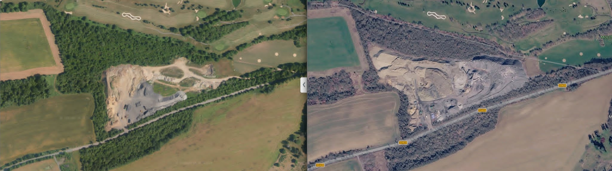

# Skládka Molitorov (Kouřim)

## O co jde

V Molitorově, v areálu Golf Molitorov u Kouřimi je provozována nelegální deponie stavebního odpadu. Odhadem jde o tisíce tun materiálu a navážku vysokou desítky metrů. V areálu běží drtící a třídící zařízení stavebního odpadu, jehož hluk a prašnost obtěžují obyvatele přilehlých obcí. Molitorova, Kouřimi, Bulánky - obytná zástavba je 400-1300m od zdroje.

Zařízení dosud nemá povolení provozu podle § 21 zákona č. 541/2020 Sb., o odpadech. U Krajského úřadu Středočeského kraje teprve probíhá řízení o povolení (sp. zn. SZ_130814/2025/KUSK a SZ_130820/2025/KUSK). Toto řízení bylo v prosinci 2025 přerušeno pro zásadní vady žádosti a lhůta k doplnění byla prodloužena do 31. 10. 2026. Skládka je přesto fakticky provozována.

{ align=center }

## Co je cílem

Cílem tohoto webu je informovat o probíhajících snahách zamezit nelegálnímu provozu skládky, obtěžování okolí hlukem, prachem, ničení silnic.

O co se snažím:

- dosáhnout prověření stavu příslušnými orgány (stavební úřad, ČIŽP, KHS, krajský úřad),
- přimět město Kouřim, aby jako účastník řízení aktivně hájilo zájmy svých občanů,
- zdokumentovat vývoj situace a zveřejnit dostupné dokumenty na jednom místě.

## Co na webu najdete

Průběžné zápisky k dění - podaná podání, odpovědi úřadů, fotodokumentaci a další podklady - najdete v sekci [Informace o skládce](info/index.md), řazené časově od nejnovějších.

Kontakt: skladka-molitorov@seznam.cz
