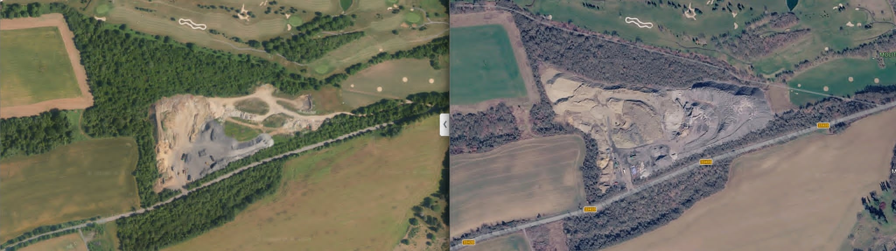

# Skládka Molitorov (Kouřim)

## O co jde

V areálu Golf Molitorov u Kouřimi je provozováno zařízení k příjmu a drcení stavebního odpadu, které nikdy nedostalo povolení podle zákona o odpadech. Jen za roky 2023 a 2024 sem podle vlastních hlášení firem přijelo **425 389 tun** odpadů, terén má podle projektové dokumentace vyrůst až o 27 metrů. Hluk a prašnost obtěžují obyvatele Molitorova, Kouřimi a Bulánky. Nejbližší domy v Molitorově jsou 300 až 400 metrů od zdroje, do Kouřimi je drtičku slyšet na 1,4 kilometru.

!!! note "Petice - sběr podpisů skončil"

    Sběr podpisů pod petici **STOP skládce v Molitorově** skončil 20. 8. 2026.
    Po sečtení podpisů petici předáme Krajskému úřadu Středočeského kraje.
    Děkujeme všem, kdo ji podepsali.

    **[Co petice obsahovala a jak to dopadlo](/info/category/petice/)**

Zařízení dosud nemá povolení provozu podle § 21 zákona č. 541/2020 Sb., o odpadech. U Krajského úřadu Středočeského kraje teprve probíhá řízení o povolení (sp. zn. SZ_130814/2025/KUSK a SZ_130820/2025/KUSK). Toto řízení bylo v prosinci 2025 přerušeno pro zásadní vady žádosti a lhůta k doplnění byla prodloužena do 31. 10. 2026. Skládka je přesto fakticky provozována.

!!! warning "Stav k 23. 8. 2026"

    - **Ve středu 26. 8. od 18:00 se koná poslední zasedání zastupitelstva Kouřimi před volbami.** [Podrobnosti k zasedání](./info/prispevky/2026-08-22-zasedani-26-srpna.md)
    - Zařízení nemá povolení provozu dle § 21 zákona o odpadech, řízení u KÚSK je přerušeno. Lhůta pro doplnění žádosti běží do **31. 10. 2026**.
    - Magistrát hl. m. Prahy [14. 8. zamítl podnět](./info/prispevky/2026-08-18-magistrat-zamitl-podnet.md) ke změně nebo zrušení povolení mobilních drtiček. Obě povolení dál platí.
    - Kraj v roce 2024 zaplatil za opravy silnice do Molitorova
      [10,15 milionu korun](./info/prispevky/2026-08-23-silnice-kourim-molitorov.md). 1.8. jsme se správy silnic zeptali, co má k příčině poškození.
    - 16.8. o kauze psaly [Novinky.cz](./info/prispevky/2026-08-19-molitorov-na-novinkach.md)

{ align=center }

## Co je cílem

Cílem tohoto webu je informovat o probíhajících snahách zamezit nepovolenému provozu skládky, obtěžování okolí hlukem, prachem, ničení silnic.

O co se snažíme:

- dosáhnout prověření stavu příslušnými orgány (stavební úřad, ČIŽP, KHS, krajský úřad),
- přimět město Kouřim, aby jako účastník řízení aktivně hájilo zájmy svých občanů,
- zdokumentovat vývoj situace a zveřejnit dostupné dokumenty na jednom místě.

## Co na webu najdete

Průběžné zápisky k dění - podaná podání, odpovědi úřadů, fotodokumentaci a další podklady - najdete v sekci [Informace o skládce](info/index.md), řazené časově od nejnovějších.

## Spolek a volby do zastupitelstva

!!! note ""
    Protože se téma "řešíte skládku, protože je před volbami"  opakuje, odpovídáme takhle samostatně.

    Spolek Za Molitorov je nepolitický a do komunálních voleb nejde. Žádnou kandidátku nepodporujeme a žádná kandidátka nemluví  jménem spolku.

    Volby pro nás nejsou příležitost, ale komplikace. Řízení u krajského úřadu a předvolební období se prostě časově sešly - a následkem toho je, že se věcný problém motá dohromady s volební kampaní. To naší věci škodí. Skládka obtěžuje lidi bez ohledu na to, koho volí.

    Je pravda, že s některými současnými zastupiteli spolupracujeme a oni kandidují i letos do voleb. Kandidatura je jejich rozhodnutí, ne naše. Ze své pozice zastupitelů nám pomohli k prvním podkladům o řízení, když jsem se ptal, co se se skládkou děje. Bez nich bychom dodnes neměli v ruce nic. Patří jim za to dík. Nic víc z toho neplyne.

    Řízení u krajského úřadu potrvá minimálně do konce října 2026, tedy přes volby. Skládka tu ale evidentně bude i potom.

    Naše práce se volbami nemění: budeme dál požadovat, aby město jako účastník řízení podalo stanovisko a hájilo zájmy svých obyvatel.

    To samé budeme chtít po zastupitelstvu, které z voleb vzejde - ať bude složené jakkoli.

    Zdeněk Burda 
    předseda spolku 
    Spolek Za Molitorov
