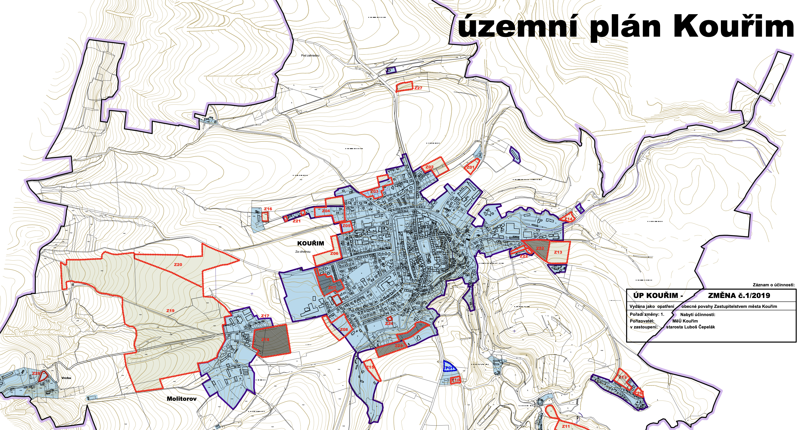
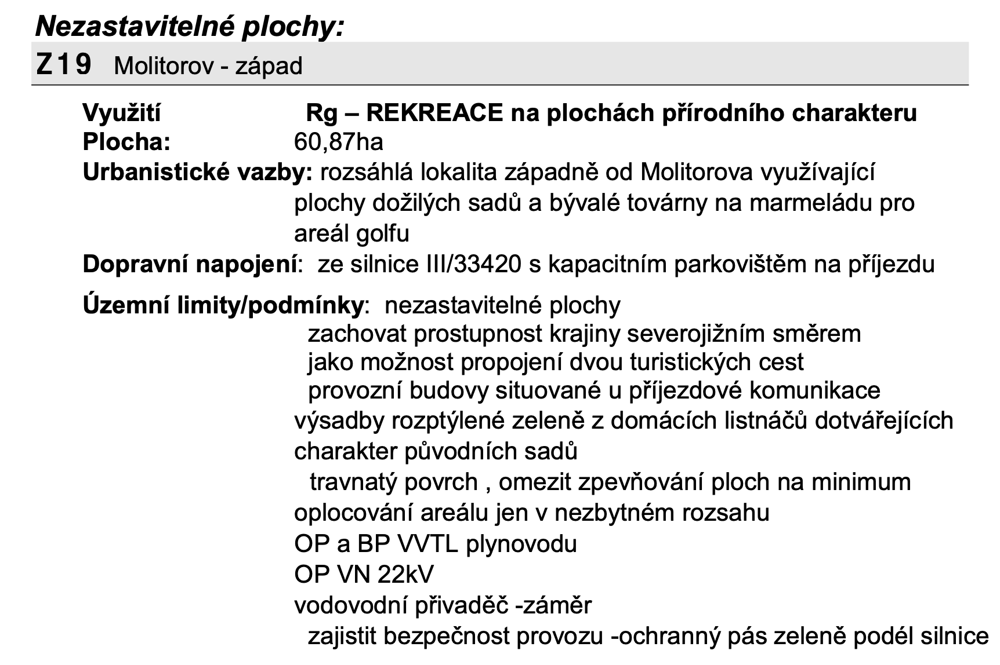
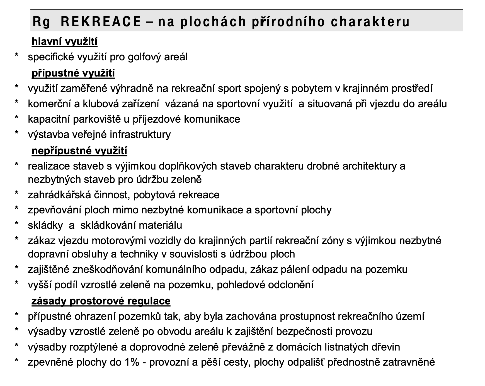
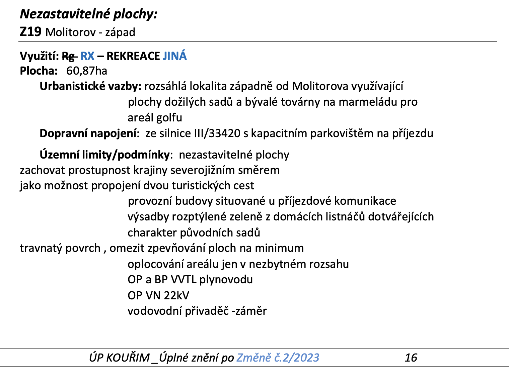
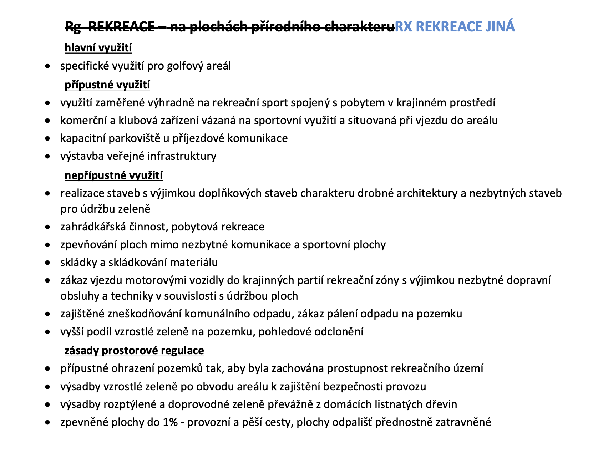

# Územní plán města Kouřim

Na webových stránkách města, konkrétně na adrese [Územní plán města Kouřim](https://www.mestokourim.cz/uzemni-plan-mesta-kourim/ms-5270) je vystaven územní plán ve kterém je oblast vedle Molitorova jednoznačně označena jako "REKREACE".

Na odkazovaném webu je trošku zmatek - je tam verze označená jako platné znění, je tam verze po změně č. 2, ale asi ještě není platná(?), vše pár let staré. Ale jsou poměrně konzistentní v tom, že se jedná o nezastavitelnou plochu určenou k rekreaci.

Dovolím si vypíchnout konkrétní část:

> **nepřípustné využití**
>
> * zpevňování ploch mimo nezbytné komunikace a sportovní plochy
> * skládky a skládkování materiálu

<!-- more -->

## Verze označená jako "platné znění"

### Mapa

{ align=center }

### Popis plochy Z19

{ align=center }

### Popis využití plochy

{ align=center }

## Verze "po 2. změně"

### Mapa - verze po 2. změně

{ align=center }

### Popis plochy Z19 - verze po 2. změně

{ align=center }

### Popis využití plochy - verze po 2. zmeně

{ align=center }
