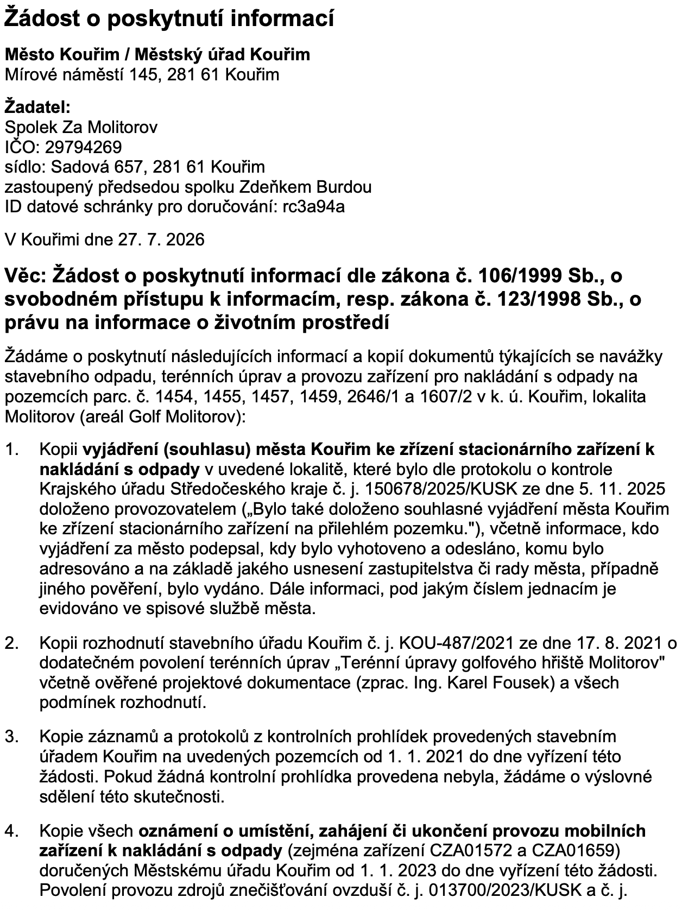
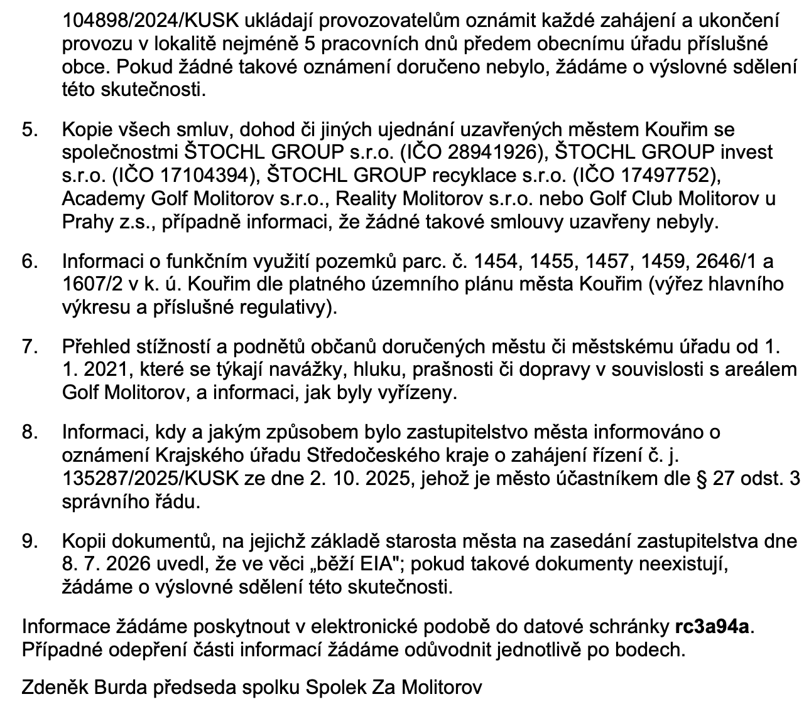
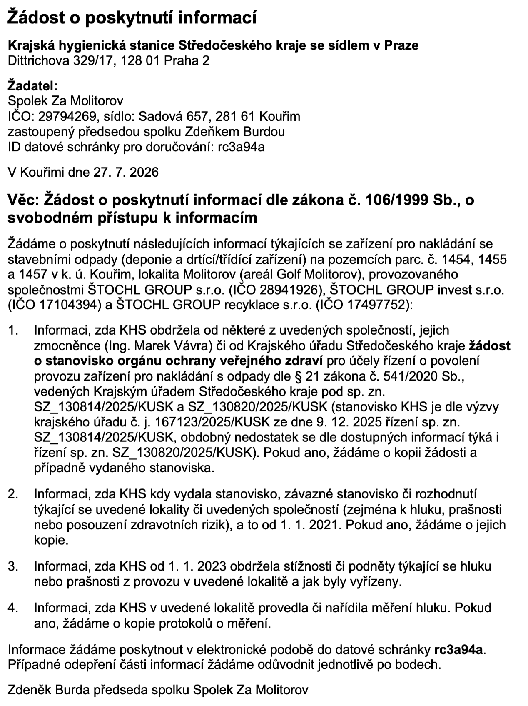
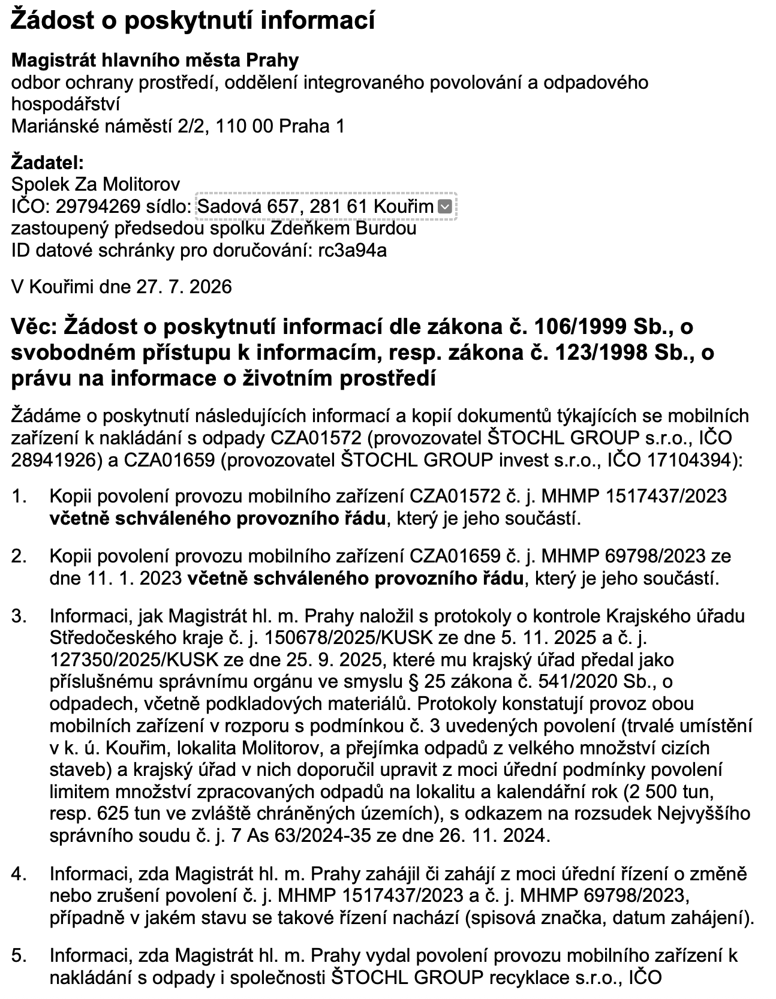
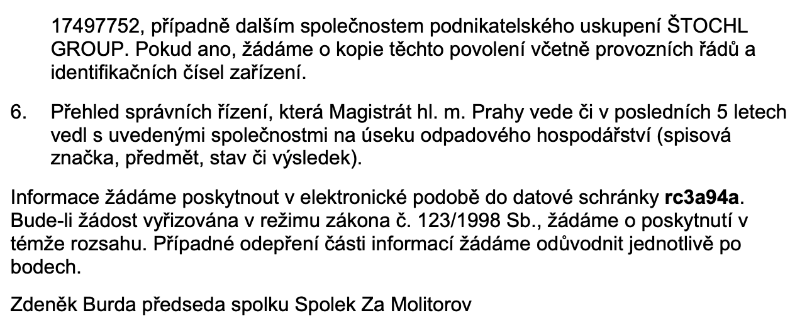

# Další žádosti o informace

Po [analýze poskytnutých informací](./2026-07-27-odpoved-ku-na-106.md) jsme se rozhodli požádat o doplňující informace i na dalších úřadech, nejen na [KÚ](./2026-07-27-zadost-o-dalsi-informace.md), ale i na další účastníky:

- Město Kouřim - [zadost-106-mesto.pdf](../../assets/info/files/106_20260727/zadost-106-mesto.pdf)
- Krajská hygienická stanice - [zadost-106-khs.pdf](../../assets/info/files/106_20260727/zadost-106-khs.pdf)
- Pražský magistrát - [zadost-106-mhmp.pdf](../../assets/info/files/106_20260727/zadost-106-mhmp.pdf)

<!-- more -->

## Kouřim

{ width="600", align=center }
{ width="600", align=center }

## Krajská hygienická stanice

{ width="600", align=center }

## Pražský magistrát

{ width="600", align=center }
{ width="600", align=center }

