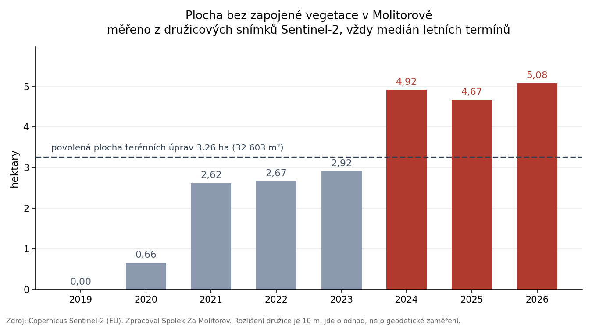
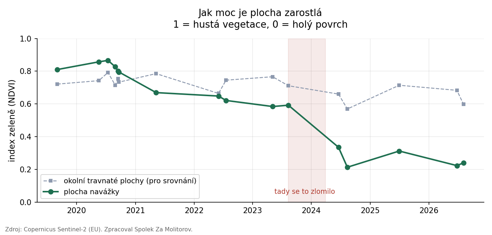

<!-- DRAFT - před publikací:
1. NEPUBLIKOVAT dřív, než odejde doplnění vyjádření ke krajskému úřadu (okno 10.-15. 8.).
   Analýza je hlavní argument toho podání; kdyby vyšla dřív, dáme protistraně náskok.
2. Zkontrolovat, že v textu není nic o druhu naváženého materiálu opřené o družicová data.
   Index měří jen zeleň, ne materiál. Viz podklady/copernicus/kam-pouzit.md, pravidlo 3.
3. Nechat projít Honzou Urbanem (žádný veřejný text bez druhých očí).
4. Aktualizovat datum, smazat draft: true a tento blok, mkdocs build, commit včetně site/.
5. Vložit do docs/casova-osa.md za blok "3. 8. 2026 / DPP" tento hotový záznam:

6. 8. 2026Rozbor

Zpracována časová řada družicových snímků Sentinel-2 (program Copernicus, EU), 37 termínů
od září 2019 do srpna 2026. **Plocha bez souvislé vegetace vzrostla z nuly na 5,06 hektaru;
povoleno bylo 3,26 hektaru.** Půl hektaru je obnaženo už v květnu 2020, tedy patnáct měsíců
před vydáním dodatečného povolení. Od roku 2024 se plocha přestala zazeleňovat.

[Zápisek k družicovým snímkům](info/prispevky/2026-08-17-satelitni-snimky.md)

-->

# Družice fotí Molitorov od roku 2015. Spočítali jsme, jak plocha rostla

Evropské družice Sentinel-2 snímkují každé místo v Česku přibližně jednou za pět dnů a snímky jsou volně ke stažení. Vzali jsme 37 termínů od září 2019 do srpna 2026 a spočítali jednu jedinou věc: jak velká část Molitorova je bez souvislé vegetace. Vyšlo z toho, že plocha vzrostla z nuly na zhruba pět hektarů. Povoleno jich bylo 3,26.

<!-- more -->

## Nejdřív se na to podívejte

Časosběr z družicových snímků, leden 2020 až srpen 2026. Vpravo nahoře je datum snímku.

Světlá skvrna uprostřed je navážka. Zbytek je golfové hřiště, pole a remízy.

## Co jsme měřili

Družice zaznamenává, kolik světla se od povrchu odráží v jednotlivých barvách, včetně infračervené, kterou oko nevidí. Zdravá zelená rostlina infračervené světlo odráží velmi silně, holá zemina nebo štěrk mnohem méně. Z poměru těchto dvou hodnot se počítá index zeleně, kterému se říká NDVI. Louka má v létě kolem 0,8, čerstvě navezená hlína kolem 0,2.

Vymezili jsme si nad lokalitou pevnou plochu 9,46 hektaru, která je pro všechny termíny stejná, a v ní počítali, kolik hektarů má index nižší než 0,3, tedy je bez souvislého porostu.

{ align=center }

## Tři věci, které z toho plynou

**V roce 2019 tam nebylo nic, dnes je tam pět hektarů.** K 3. září 2019 nemá měřená plocha ani hektar bez vegetace. K 25. červnu 2026 jich je 5,06. Dodatečné povolení terénních úprav z roku 2021 přitom počítalo s plochou 32 603 m², tedy 3,26 hektaru. Rozdíl je 55 procent.

**Terén se začal měnit dřív, než přišlo povolení.** Stavební úřad vydal dodatečné povolení 17. srpna 2021. Družicové snímky ukazují půl hektaru bez vegetace už 18. května 2020 a zhruba 2,6 hektaru 10. května 2021, tedy tři měsíce před vydáním povolení. Na tom není samo o sobě nic překvapivého, dodatečné povolení se ze své podstaty vydává na něco, co už se děje, a úřad to věděl. Zajímavější je poměr: v době, kdy se rozhodovalo o povolení pro 3,26 hektaru, byly už zhruba čtyři pětiny té plochy obnažené.

**Od roku 2024 to přestalo zarůstat.** Do roku 2023 se obnažená zemina přes léto sama zazelenala. V roce 2021 byla plocha bez vegetace v květnu 2,62 hektaru a na konci října jen 0,53. To je chování hlíny, na které vyrostou kopřivy. Mezi srpnem 2023 a březnem 2024 se to zlomilo a od té doby se plocha nezazelenala ani jednou, zatímco okolní travnaté plochy vypadají pořád stejně.

{ align=center }

Do stejného období, kdy se to zlomilo, spadá i kontrolní prohlídka stavebního úřadu z 9. listopadu 2023. Ta je v protokolu uzavřena slovy „bez připomínek". Mezi posledním snímkem před ní (11. srpna 2023, 2,99 ha) a prvním po ní (28. března 2024, 4,65 ha) plocha vzrostla o 1,66 hektaru.

## Pro šťouraly: jak se to počítalo

**Zdrojová data.** Družice Sentinel-2 programu Copernicus, který provozuje Evropská unie. Data jsou volně dostupná v aplikaci [Copernicus Browser](https://browser.dataspace.copernicus.eu). Použili jsme pásma B04 (červené) a B08 (blízké infračervené) z produktu L2A, tedy po atmosférické korekci, ve formátu GeoTIFF, 37 termínů od 3. 9. 2019 do 5. 8. 2026. Doplňkově 38 barevných náhledů, které zahušťují mezery mezi termíny.

**Postup.** Z pásem se pro každý pixel spočítá NDVI = (B08 − B04) / (B08 + B04). Uvnitř pevného polygonu o rozloze 9,46 ha se sečtou pixely s hodnotou pod 0,3. Polygon není nakreslený od oka: je odvozený z dat jako souvislá plocha, která byla v letech 2023 až 2026 opakovaně bez vegetace, rozšířená o technický odstup zhruba 29 metrů. Končí před lesním pásem, před polními bloky a před silnicí, aby do měření nespadla sezonní orba okolních pozemků.

**Co jsme udělali proti omylům.** Vyhodnocujeme jen termíny od 5. května do 30. září, protože v zimě klesá index i na plochách, které zůstávají zatravněné. Vyřadili jsme čtyři snímky se sněhem nebo oblačností. Jako kontrolu sledujeme dvě plochy mimo lokalitu, lesní pás a travnaté plochy hřiště; ty se po celou dobu drží mezi 0,52 a 0,86, takže snímky jsou mezi sebou srovnatelné. Posunutí hranice polygonu o jeden pixel na obě strany mění výsledek nejvýš o 0,14 hektaru.

**Kontrola proti leteckým snímkům.** U tří leteckých měřických snímků Českého úřadu zeměměřického a katastrálního existuje družicový snímek pořízený o jeden až dva dny později. Sedí: 3. června 2019 nula, 11. srpna 2023 2,99 hektaru, 20. června 2025 4,93 hektaru.

**Data si můžete přepočítat sami.** Měření po jednotlivých termínech je v tabulce níže, celý postup i s výpočetním skriptem popisuje připojený rozbor. Skript rád pošleme komukoli, kdo si chce výsledek ověřit.

## Co z toho naopak neplyne

Družicový index rozlišuje jenom to, jestli je povrch porostlý, nebo ne. **Neříká nic o tom, co se do Molitorova vozí**, jestli je to zemina, beton nebo něco jiného, ani jak je navážka vysoká a kolik toho tam je. To víme odjinud, hlavně z [protokolů krajského úřadu](./2026-07-27-protokoly-krajskeho-uradu.md), které mluví o 425 tisících tun za roky 2023 a 2024.

Rozlišení družice je deset metrů na pixel, takže všechny plochy jsou odhad, ne geodetické zaměření. Uvádíme je zaokrouhleně a s tím, že hranice může být o kus jinde.

## Co s tím děláme

Rozbor jsme přiložili k vyjádření v řízeních, ve kterých krajský úřad rozhoduje o povolení provozu zařízení na odpady. Územní plán v této ploše žádá „plochy odpališť přednostně zatravněné" a zpevněné plochy do jednoho procenta. Pět hektarů, které se dva roky nezazelenaly, je s tím těžko slučitelné.

Druhá věc je 26. srpna. Ten den uplyne prodloužená lhůta, do kdy měly být terénní úpravy dokončené, a stavební úřad má podle povolení nařídit závěrečnou kontrolní prohlídku. Ta má porovnat, co bylo povoleno, s tím, co je na místě. Zeptáme se na zastupitelstvu, jestli úřad vůbec má čím měřit, tedy jestli existuje geodetické zaměření skutečného rozsahu.

## Dokumenty

- [Rozbor družicové časové řady Sentinel-2, úplné znění](../../assets/info/files/sentinel/analyza-sentinel-2.pdf) (pdf)
- [Měření po jednotlivých termínech](../../assets/info/files/sentinel/sentinel-mereni-po-terminech.csv) (csv)
- [Podrobný graf se všemi termíny](../../assets/img/sentinel-graf-podrobny.png) (png)
- Zdrojová data: [Copernicus Browser](https://browser.dataspace.copernicus.eu), Sentinel-2, © European Union
