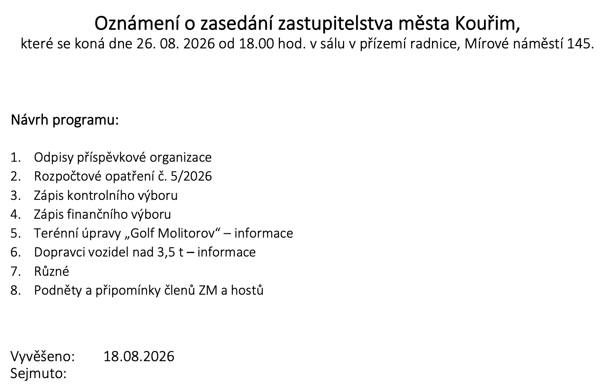

# Ve středu 26. srpna zasedá zastupitelstvo naposledy před volbami

Zasedání zastupitelstva města Kouřim se koná **ve středu 26. srpna od 18.00 hodin v sálu v přízemí radnice na Mírovém náměstí 145**. Je to poslední zasedání před volbami, které se konají 9. a 10. října. Nové zastupitelstvo se poprvé sejde nejspíš až v listopadu, takže cokoli z toho, co se ve středu neprojedná, leží až do zimy.

<!-- more -->

Na stejný den připadá ještě jedna událost - 26. srpna vyprší lhůta k dokončení terénních úprav podle dodatečného povolení z roku 2021. Původní lhůta skončila 26. srpna 2024 a byla prodloužena o dva roky. Rozhodnutí o tom prodloužení jsme dosud neviděli, přestože jeho existenci město potvrdilo dvakrát vlastními slovy. A závěrečná kontrolní prohlídka, kterou povolení ukládá provést po dokončení prací, se podle sdělení města z 10. srpna nikdy nekonala.

## Co je na programu

Pozvánka vyvěšená na úřední desce města 18. srpna uvádí osm bodů. Kauzy se přímo týkají dva:

- bod 3 **Zápis kontrolního výboru**
- bod 5 **Terénní úpravy "Golf Molitorov" - informace**

Poslední bod programu se jmenuje **Podněty a připomínky členů ZM a hostů**. To je místo, kde může mluvit kdokoli z veřejnosti.

{ align=center }

## Co zastupitelstvo uložilo

Usnesení **45/2026** ze 8. července, přijaté devíti hlasy z jedenácti přítomných, dalo městu třicetidenní lhůtu na sedm konkrétních úkonů. Ta lhůta skončila **7. srpna**. Část III. téhož usnesení ukládá kontrolu jeho plnění kontrolním výborem.

Vedle toho je tu usnesení **16/2026** z února, kdy zastupitelstvo pověřilo odbor životního prostředí městského úřadu prošetřením situace u výstavby odpaliště. Od té doby je vedeno jako nesplněné.

## Co jsme od července zjistili

Od posledního zasedání dorazily odpovědi na naše žádosti o informace:

- Závazné stanovisko z března 2021, na které odkazuje podmínka dodatečného povolení, připouští použití odpadů **do 10 000 tun**. Podle ročních hlášení, která provozovatelé sami podali státu, bylo za roky 2023 a 2024 přijato **425 389 tun** ([článek ze 14. srpna](./2026-08-14-limit-10000-tun.md)).
- Krajská hygienická stanice písemně potvrdila, že o závazné stanovisko k povolení provozu **za osm měsíců od výzvy krajského úřadu nikdo nepožádal** ([článek ze 17. srpna](./2026-08-17-odpoved-khs.md)).
- Živnostenské úřady v Kolíně a v Praze 4 potvrdily, že žádná z provozujících firem **nemá nikde ohlášenou provozovnu**, přitom krajskému úřadu samy ohlásily provoz na parcelách 1454, 1455 a 1457 čtyři roky po sobě ([článek z 10. srpna](./2026-08-10-odpoved-zivnostenskeho-uradu.md)).
- Město v odpovědi z 10. srpna uvedlo, že **souhlasné vyjádření k záměru nevydalo**. V kontrolním spisu krajského úřadu je přitom vyjádření města vedeno jako doložené ([článek z 12. srpna](./2026-08-12-odpoved-mesta-a-stavebniho-uradu.md)).
- K plnění usnesení 45/2026 město 13. srpna vyvěsilo tři dokumenty. Ani jeden nebyl nový, všechny tři jsme měli z vlastních žádostí už z července ([článek ze 13. srpna](./2026-08-13-mesto-zverejnilo-dokumenty.md)).
- Magistrát hlavního města Prahy náš podnět k povolením pro mobilní zařízení **zamítl** ([článek z 18. srpna](./2026-08-18-magistrat-zamitl-podnet.md)).

## Co chceme na zasedání slyšet

Jak dopadlo plnění usnesení 45/2026 bod po bodu. Která ze dvou písemností města o souhlasném vyjádření platí a zda to město krajskému úřadu sdělí. Jak chce stavební úřad při závěrečné kontrolní prohlídce zjistit skutečný rozsah navezeného materiálu. A odpověď na otázku, která se v Kouřimi zatím nahlas nepoložila: provozující společnosti mají základní kapitál v řádu desítek tisíc korun, takže kdo zaplatí odstranění, pokud povolení nakonec nedostanou.

## Jak se můžete zapojit

Přijďte a sedněte si. Nic víc není potřeba, zasedání je veřejné a plný sál je sám o sobě sdělení. V červenci přišlo lidí nezvykle mnoho a na jednání zastupitelstva to mělo vliv.

Kdo chce mluvit, může. Podle § 16 odst. 2 písm. c) zákona o obcích má občan města starší osmnácti let právo vyjadřovat na zasedání zastupitelstva svá stanoviska k projednávaným věcem. Totéž právo má podle § 16 odst. 3 vlastník nemovitosti na území města, i když tu nemá trvalý pobyt. Stačí se přihlásit, představit se a mluvit k věci. U bodu 5 se dá mluvit k terénním úpravám přímo, na bodu 8 k čemukoli dalšímu.

**Ve středu 26. srpna od 18.00, sál v přízemí radnice, Mírové náměstí 145. Přijďte.**
