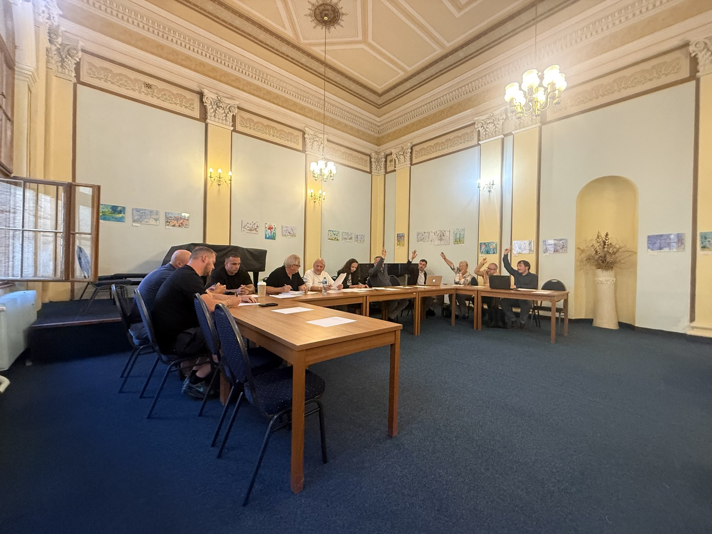

# Zastupitelstvo o Molitorově: dva návrhy, ani jeden neprošel

Jednání trvalo od šesti do třičtvrtě na osm a poprvé za celou dobu na něj přišli i zástupci strany, která v Molitorově naváží a drtí. Na část otázek odpověděli, na část řekli, že odpovídat nebudou, a půl hodiny před koncem zasedání oba odešli. Zastupitelé pak hlasovali o dvou návrzích k Molitorovu. Neprošel ani jeden, druhému chyběl jediný hlas.

<!-- more -->

*Ilustrační foto: hlasování zastupitelů.*

Na poslední řádné zasedání zastupitelstva Kouřimi před volbami přišlo 26. srpna víc lidí než v červenci. Kdo o kauze čte poprvé: co se v Molitorově děje a jak se to vyvíjelo, shrnuje [souhrn](../../souhrn.md) a interaktivní [Příběh skládky](https://skladka-molitorov.cz/pribeh/).

!!! info "Co jsme se na zasedání dověděli"

    - Povolení provozu zařízení k nakládání s odpady podle § 21 zákona o odpadech pro Molitorov podle starosty neexistuje ("Není") a město neeviduje ani žádný jiný dokument, o který by se přijímání a drcení zeminy opíralo ("Určitě nemáme").
    - Město neobdrželo svůj zákonný podíl 400 000 Kč z pravomocné pokuty České inspekce životního prostředí a o rozhodnutí "oficiálně neví".
    - Firmy vykládají limit 10 000 tun tak, že jde o odpad, který stavba vyprodukuje, ne o materiál, který se do lokality přiveze. Samy přitom za dva roky ohlásily přijetí 425 389 tun odpadu.
    - Souhlasné vyjádření města, které je založeno v kontrolním spisu kraje, město podle starosty nevydalo. Kraji to písemně sdělí a vyžádá si kopii listiny, obojí "během příštího týdne".
    - Mimořádné zasedání zastupitelstva bude ve čtvrtek 1. října.

!!! warning "Co jsme se nedověděli"

    - Zda má firma povolení k provozu stacionárního zařízení, jehož provoz bez povolení konstatoval ve dvou protokolech krajský úřad ("Nebudeme odpovídat").
    - Zda firma odstraní navezený materiál na vlastní náklady, pokud povolení nedostane ("Co to je za otázku?!").
    - Kolik tun materiálu už v lokalitě je ("Ne" na otázku, zda o tom mají hosté představu).
    - Zda město v běžících krajských řízeních navrhne podmínky vylučující další navážení ("Nebudeme odpovídat").
    - Jak vypadá projektová dokumentace ("Tak vzhledem k tomu, jak se chováte, tak vám to určitě neposkytneme.").
    - Kdo zaplatí případné odstranění navážky. Návrh, aby se město na to zeptalo kraje a inspekce, neprošel o jeden hlas.
    - Co zjistil kontrolní výbor. Zprávu podle usnesení č. 45/2026 nepředložil a na zasedání nebyl přítomen žádný z jeho členů.

## Kdo přišel

Starosta Luboš Čepelák v úvodu bodu přivítal "zástupce realizační firmy STOCHL GROUP pana Faltyse a pana Skočdopoleho". Asi o hodinu později se jeden z hostů proti tomu ohradil: "Já nejsem zástupce firmy ŠTOCHL GROUP, ale jsem spolumajitelem firmy Golf Academy, který má zájem na tom, aby se to dodělalo, aby se to řádně dodělalo a co nejdříve."

> **Jiří Faltys** - podle obchodního rejstříku 50% společník Academy Golf Molitorov s.r.o., tedy firmy, která je objednatelem stavby. Starosta ho na zasedání uvedl jako zástupce realizační firmy ŠTOCHL GROUP, on sám se o hodinu později označil za spolumajitele golfové firmy.
>
> **Tomáš Skočdopole** - jednatel Academy Golf Molitorov s.r.o. od jejího vzniku 1. března 2021. V květnu téhož roku zpracoval oznámení EIA k záměru golfového hřiště a v tomto řízení zastupoval oznamovatele, tedy vlastníka pozemků Reality Molitorov s.r.o. Právě v tom oznámení stojí, že se použije nejvýše 10 000 tun nezávadné zeminy. Na zasedání vystupoval za golfový klub, což je jiná právnická osoba (GOLF CLUB MOLITOROV z.s.), a uvedl, že "vyřizoval stavební povolení".

Z nahrávky nebylo vždy rozlišitelné, kdo z obou hostů právě mluví. Kde to nevíme jistě, píšeme "zástupci firem". Pokud v článku narazíte na chybu, napište - obratem ji opravíme.

## "Nebudeme odpovídat"

První otázky padly hned v úvodním informačním bloku, kde starosta předal hostům slovo. Za spolek jsme se zeptali na to, co ve dvou protokolech konstatoval krajský úřad, tedy na provoz stacionárního zařízení bez povolení. Má k němu firma povolení?

Odpověď: "Nebudeme odpovídat."

Druhá otázka zněla, zda se před zastupitelstvem zaváží, že pokud povolení vydáno nebude, odstraní navezený materiál na vlastní náklady.

"Co to je za otázku?!" reagoval jeden z nich.

Odpověď nepadla. Zástupci firem si místo toho sami položili otázku, zda stavba má stavební povolení, a sami si na ni odpověděli: "Ano, tato stavba má stavební povolení."

## Spor o 10 000 tun

Jádro celé kauzy se ukázalo v jedné výměně. Závazné stanovisko, o které se povolení terénních úprav opírá, mluví o nejvýše 10 000 tunách. Firmy přitom samy do systému ISPOP ohlásily za roky 2023 a 2024 přijetí 425 389 tun odpadu. To je víc než čtyřicetinásobek limitu.

Pan Faltys to vyložil takto: "Můžu odpovědět, ať se v těch otázkách neztratíme? Takže 10000 tun odpadu může vzniknout, po dobu celé výstavby golfového hřiště může vzniknout maximálně 10000 tun odpadu."

Tedy: limit se podle nich vztahuje na odpad, který stavba **vyprodukuje**, ne na materiál, který se do lokality **přiveze**. Když padla otázka na ohlášených 425 tisíc tun, odpověď zněla: "Jestli tam máte čísla, asi to tak bude. S tím, že z toho může vzniknout maximálně, po dobu celé výstavby, 10 000 odpadu."

Na otázku, zda s tímto výkladem obstojí před soudem, odpověděl: "Samozřejmě."

Jejich výklad je na záznamu veřejného zasedání. Posoudit ho budou muset úřady.

Ptali se i lidé v sále. Jedna z otázek zněla, zda mají hosté představu, kolik tun materiálu už je v lokalitě navezeno.

"Ne."

## Povolení podle zákona o odpadech? "Není"

Nejdůležitější odpověď večera padla na dotaz, zda pro Molitorov existuje povolení provozu zařízení k nakládání s odpady podle § 21 zákona o odpadech.

Na otázku, která mířila na město, začal odpovídat jeden z hostů (pan Faltys): "Za mě to je otázka přece na životní prostředí…" Po upozornění, že se ptáme města, označil položené otázky za "naprosto nesmyslný" a dodal, že jsou "možná vyvozeny možná z nějaký AI, která vám to tam sestavila".

O dvě minuty později tutéž otázku zodpověděl starosta: "Za mě, asi zde k dispozici není, zeptejte se na ORPčko Kolín životní prostředí, jestli tam něco mají. Za nás tady nic není." A na upřesňující dotaz, zda tedy takové povolení není: "Není."

Na otázku, zda město eviduje jakýkoli jiný dokument, o který se opírá oprávnění přijímat a drtit v lokalitě zeminu z cizích staveb, odpověděl: "Určitě nemáme."

## Město svůj podíl na pokutě nedostalo

Inspekce uložila pokutu 800 000 Kč a [rozhodnutí je od 24. dubna 2026 pravomocné](./2026-08-25-pokuta-cizp-pravomocna.md). Podle § 124 odst. 2 zákona o odpadech je polovina, tedy 400 000 Kč, příjmem rozpočtu obce, na jejímž území k porušení došlo, a rozhodnutí město Kouřim označuje včetně čísla účtu.

Obdrželo město peníze? "Neobdrželo." Ví o rozhodnutí? "Město oficiálně o tom neví, každopádně jsme žádný peníze nedostali."

## "To se asi musíte zeptat na stavební úřad"

U řady dalších otázek starosta odkázal jinam nebo na později. Na dotaz, zda bylo stavebnímu úřadu oznámeno dokončení terénních úprav, jejichž lhůta právě téhož dne uplynula: "To se asi musíte zeptat na stavební úřad." Na dotaz, čím úřad při závěrečné prohlídce posoudí soulad provedení s povolením: "Stavební úřad toto dělá, takže se musíte zeptat na stavební úřad." A na otázku, zda město v běžících krajských řízeních navrhne podmínky vylučující další navážení, po několika kolech upřesňování: "Nebudeme odpovídat." Na otázku k plochám v územním plánu: "Todle vám odpovím příště, to opravdu teď nevim."

**K vyjádření města v kontrolním spisu kraje.** Protokol krajského úřadu uvádí, že kontrolovaná osoba doložila "souhlasné vyjádření města Kouřim ke zřízení stacionárního zařízení na přilehlém pozemku". Starosta k tomu řekl: "Já si myslím, že asi ne. Určitě, žádný speciální jsme nepodávali." Slíbil, že to město kraji písemně sdělí a že si od kraje vyžádá kopii listiny, obojí "během příštího týdne".

**Ke zprávě kontrolního výboru.** Jedna z předaných otázek mířila na zprávu kontrolního výboru podle bodu III usnesení č. 45/2026. Zpráva na zasedání předložena nebyla a jednání se neúčastnil žádný ze tří členů výboru.

**K usnesení č. 16/2026**, kterým zastupitelstvo už 25. února pověřilo odbor životního prostředí prošetřením situace a které je ve čtyřech po sobě jdoucích zápisech vedeno jako nesplněné, starosta uvedl, že životní prostředí město "legislativně v pravomoci" nemá a vykonává je ORP Kolín. Na otázku, kdo tedy odpovídá za to, že usnesení zastupitelstva zůstává půl roku nesplněné, odpověděl: "Asi já, ne? Nebo jak to vidíte?"

## Prach a termín dokončení

Zastupitel Josef Šmejkal se zeptal na to, co lidé v okolí vnímají nejvíc: "Je zvýšená prašnost, myslím si, že si toho všímáme opravdu všichni. Máte nějaké opatření proti tý prašnosti?" Zástupci firem odpověděli, že se komunikace kropí a je na to kropicí vůz. Na doplňující dotaz, zda existuje nějaké zařízení, které by obyvatele Molitorova a okolí chránilo, odkázali na zhotovitele stavby a na proběhlé kontroly. V téže odpovědi zaznělo i hodnocení: "My to spíš vnímáme, že to je tady náká volební agitace, do které jsme byli bohužel zataženi."

Na otázku z publika, kdy bude hřiště hotové, odpověděl jeden z hostů, že by chtěli, "aby to do těch dvou let bylo dodělaný", a dodal, že "ta stavba automaticky se prodlužuje dál". Na námitku, že automaticky se žádná stavba neprodlužuje, odpověděl: "Já vám na to odpovím: doptejte se na stavebním úřadu."

## "Určitě vám to neposkytneme"

Několikrát, od nás i od lidí v sále, padla prosba o nahlédnutí do projektové dokumentace. Jedna z přítomných to řekla takto: "Moje dítě je členem golfového klubu, tak bych to také chtěla vidět."

Tomáš Skočdopole odpověděl: "Tak vzhledem k tomu, jak se chováte, tak vám to určitě neposkytneme."

Tajemník města k témuž dodal, že požadavky zaznamenává a že pokud projekt město mít nebude, požádá o něj stavební úřad.

## Oba zástupci odešli

Tomáš Skočdopole vstal a odešel zhruba v 19:12, kdy diskuse trvala přes hodinu. Na dotaz, zda odchází, řekl: "Na to nemám sílu, na vás. Ne, lži lži a lži."

Jiří Faltys odešel o pár minut později, uprostřed otázky, která mířila na provozovnu jedné z firem skupiny: "Omlouvám se, odpověď nemám."

Zbytek jednání, tedy i obě hlasování o Molitorově, proběhl bez nich.

## Hlasování: 5 a 7 z potřebných 8

Zastupitelstvo města Kouřim má 15 členů. K přijetí usnesení je potřeba souhlasu nadpoloviční většiny všech členů, tedy osmi hlasů, bez ohledu na to, kolik jich na jednání dorazí. Přítomno bylo deset zastupitelů, pět chybělo.

Oba návrhy na zasedání přečetl Jan Bug.

**První návrh** ukládal starostovi, aby město jako účastník obou krajských řízení navrhlo podmínky, jimiž by bylo do pravomocného rozhodnutí vyloučeno další přijímání materiálu do lokality a jeho drcení a třídění.

Pro hlasovalo pět zastupitelů: Jan Bug, Vladimír Rišling, Josef Šmejkal, Petr Němec a Sylva Kroužilová. Pět se zdrželo: Jiří Jeneš, Josef Hasil, Libor Chmel, starosta Čepelák a místostarostka Strunecká. Proti nebyl nikdo.

Po hlasování jsme požádali starostu, aby zastupitele, kteří se zdrželi, představil jménem. Zastupitel Libor Chmel při tom uvedl, že se s návrhem před hlasováním nestihl seznámit, a proto se zdržel.

**Druhý návrh** ukládal starostovi písemně požádat krajský úřad a Českou inspekci životního prostředí o sdělení, který subjekt je odpovědný za vypořádání odpadů už v lokalitě soustředěných, kdo ponese náklady jejich odstranění a v jakém termínu má být náprava provedena.

Pro hlasovalo sedm zastupitelů: k pětici z prvního hlasování se přidali Jiří Jeneš a Josef Hasil. Zdrželi se Libor Chmel, starosta Čepelák a místostarostka Strunecká. Proti opět nebyl nikdo.

Druhému návrhu tedy chyběl k přijetí jediný hlas. Nešlo přitom o nic víc než o to, aby město dvěma úřadům položilo otázku, kdo zaplatí případné odstranění navážky.

## Mimořádné zasedání 1. října

Ke konci jednání otevřeli zastupitelé Josef Šmejkal a Vladimír Rišling otázku mimořádného zasedání. Po krátké rozpravě padl termín čtvrtek 1. října, starosta termín přijal a tajemník uvedl, že se to dá do zápisu. O svolání se nehlasovalo, starosta prohlásil, že zasedání k 1. říjnu svolá.

Jednání skončilo ve 19:46.

## Co bylo předáno do zápisu

Na zasedání jsme předsedajícímu a zapisovateli předali v listinné podobě dva soubory otázek se žádostí, aby otázky i odpovědi na ně byly uvedeny v zápise, a s žádostí o písemnou odpověď na to, co nebylo zodpovězeno na místě. Oba dokumenty zveřejňujeme:

- [Otázky přednesené v diskusi (PDF)](../../assets/info/files/zasedani_zm_20260826/otazky-predane-20260826.pdf) - sedm okruhů
- [Doplňující otázky (PDF)](../../assets/info/files/zasedani_zm_20260826/otazky-doplnujici-20260826.pdf) - pět okruhů

Zápis ze zasedání musí město podle § 95 odst. 2 zákona o obcích vyhotovit do deseti dnů, tedy do 5. září, a uložit na úřadě k nahlédnutí.

## Co dál

Starosta přislíbil dva úkony do konce příštího týdne: sdělit kraji, že město souhlasné vyjádření nevydalo, a vyžádat si od kraje kopii listiny, která je v kontrolním spisu jako vyjádření města vedena. Obojí budeme sledovat.

Mimo to jsme se dozvěděli, že město po čtyřech měsících od právní moci neobdrželo svůj podíl na pokutě a o rozhodnutí inspekce oficiálně neví. Budeme se ptát, zda byla pokuta vůbec uhrazena.

A ve čtvrtek 1. října se zastupitelstvo sejde znovu. Zasedání je veřejné a kdo chce slyšet odpovědi na vlastní uši, může přijít.
