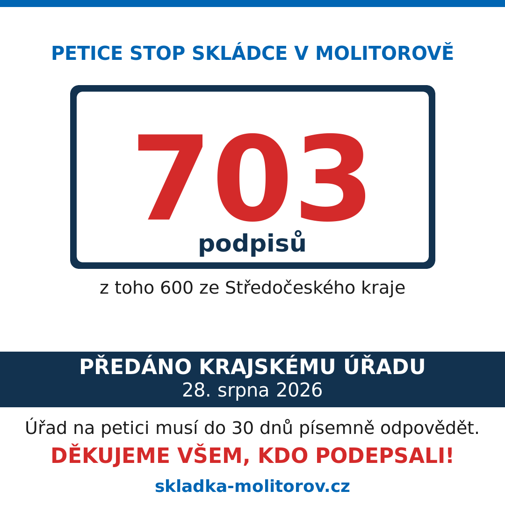
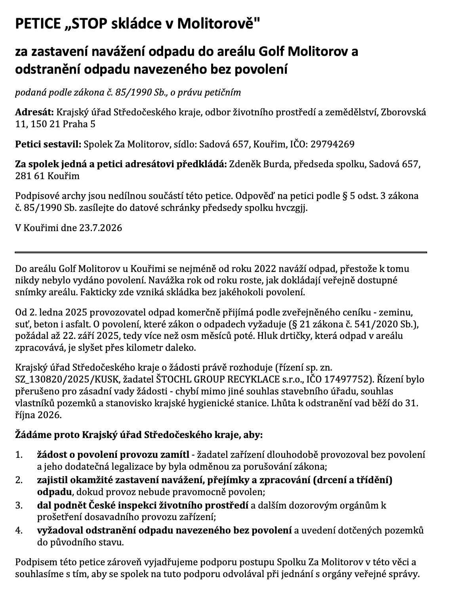

# Petici podepsalo 703 lidí, dnes ráno jsme ji předali kraji

Sběr podpisů pod petici "STOP skládce v Molitorově" skončil s **703 platnými podpisy**, z toho **600 od lidí ze Středočeského kraje**. Dnes ráno jsme petici i s podpisovými archy předali na podatelně Krajského úřadu Středočeského kraje.

<!-- more -->

{ align=center }

## Předání

Petici jsme předali v pátek 28. srpna osobně na podatelně krajského úřadu ve Zborovské ulici v Praze 5. Kromě textu petice jsme odevzdali originály 44 podpisových archů a tisk uzavřeného seznamu z portálu e-petice.

## Jak sběr probíhal

Petice byla k podpisu od 27. července do 20. srpna. Papírové archy ležely v Komunitním šatníku na faře a v Bistru U Kamene, v Olešce v hospodě a na obecním úřadu v Třebovli. Podepisovalo se i při obchůzkách po Kouřimi, Olšece a Dobrém Poli a elektronicky na portálu e-petice. Poslední zaplněné archy doputovaly ještě po uzávěrce, dva z nich přinesli na zasedání zastupitelstva 26. srpna - to jsme sběr definitivně uzavřeli.

Na papírových arších se sešlo 603 podpisů, elektronicky podepsalo 100 lidí. Podpisy přišly hlavně z Kouřimi, Molitorova, Olešky a okolních obcí, ale i z Prahy a dalších míst republiky.

## Jak jsme počítali

Každý ze 44 papírových archů jsme přepsali a řádek po řádku zkontrolovali proti originálu. Elektronické podpisy ověřuje elektronická identita, takže jsou platné všechny. Všechny dvojice se shodným jménem jsme prověřili - žádná duplicita v petici není, pokaždé jde o dva různé lidi, typicky z jedné domácnosti. Do konečného součtu se nepočítají čtyři vyřazené papírové řádky: tři přeškrtnuté a jeden bez podpisu.

Seznam podepsaných nikde zveřejňovat nebudeme a nebudeme z něj nic sdělovat - kdo petici podepsal, je věc podepsaného. Jediným adresátem podpisových archů je krajský úřad.

## Co petice žádá

Petice je adresovaná Krajskému úřadu Středočeského kraje, který právě vede řízení o dodatečné povolení provozu zařízení. Žádá čtyři věci: aby úřad žádost o povolení zamítl, protože dodatečná legalizace dlouhodobě nepovoleného provozu by byla odměnou za porušování zákona. Aby zajistil okamžité zastavení navážení, přejímky a drcení odpadu, dokud provoz nebude pravomocně povolen. Aby dal podnět inspekci a dalším dozorovým orgánům k prošetření dosavadního provozu. A aby vyžadoval odstranění odpadu navezeného bez povolení a uvedení pozemků do původního stavu. Podpisem petice byla také vyjádřena podpora spolku.

{ align=center }

Plné znění petice je [zde](../../assets/info/files/petice-molitorov.pdf).

## Co bude dál

Podle petičního zákona má úřad 30 dnů na to, aby obsah petice posoudil a písemně odpověděl - tedy do konce září. Odpověď zveřejníme. Petice sama úřadu neukládá, jak má rozhodnout, ale je to 703 lidí, kteří se k věci vyjádřili jménem a podpisem, a úřad se s tím musí vypořádat v době, kdy o povolení rozhoduje.

Všem, kdo petici podepsali, šířili ji nebo nabídli místo pro podpisové archy, děkujeme. Sedm set podpisů za tři a půl týdne je jasná zpráva, že lidem dění v Molitorově lhostejné není.
