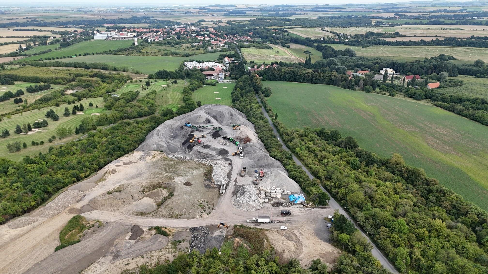

# Krajský úřad: provoz bez povolení nemáme jak zastavit. Na dodržení projektu má dohlížet stavební úřad v Kouřimi

Na konci července jsme krajský úřad požádali, aby provoz v Molitorově zastavil nebo omezil. Je to jediný úřad, který to podle zákona o odpadech může udělat. V odpovědi doručené 24. srpna píše, že provoz bez povolení "nemá defakto jak zastavit", a kontrolu dodržení projektu přisuzuje stavebnímu úřadu v Kouřimi. Podstatné části odpovědi citujeme.

<!-- more -->

*Provozní plocha navážky v Molitorově z výšky, 26. srpna 2026. Vlevo golfové hřiště, v pozadí Kouřim.*

## "Nemá defakto jak zastavit"

Zákon o odpadech dává krajskému úřadu pravomoc zastavit nebo omezit provoz zařízení. Napsali jsme mu tedy, ať ji použije - provoz bez povolení si úřad zjistil sám při vlastní kontrole a od té doby podle něj trvá.

Odpověď (č. j. 114900/2026/KUSK):

> "skutečně má pravomoc zastavit či omezit provoz zařízení postupem dle § 145 odst. 1 písm. c), nicméně v tomto případě se jedná o provozování stacionárního zařízení k nakládání s odpady bez povolení, který krajský úřad nemá defakto jak zastavit."

Rozumíme tomu tak, že kdyby zařízení povolení mělo, kraj by mu ho mohl pozastavit. Protože ho nemá, není co pozastavit. Pokuty krajský úřad ukládat nesmí, ty jsou věcí České inspekce životního prostředí.

## Dodržení projektu má kontrolovat stavební úřad v Kouřimi

Ptali jsme se také na to, že navážka leží i na pozemcích, které v povolení terénních úprav vůbec nejsou. Podle odpovědi to přísluší stavebnímu úřadu:

> "Obecně samotné provedení a provádění stavby - terénní úpravy (z hlediska zákona o odpadech tzv. zasypávání) by měl kontrolovat příslušný stavební úřad, zde Stavební úřad Kouřim, který takový stavební záměr schválil a který schválil projektovou dokumentaci a měl by kontrolovat její dodržení."

Odpověď pokračuje:

> "Krajskému úřadu není známo, že by Stavební úřad Kouřim v době vámi zmíněných prováděných kontrol konstatoval nesoulad prováděné stavby se stavební dokumentací."

Kontrola dodržení projektu tedy přísluší stavebnímu úřadu v Kouřimi a krajský úřad o žádném jeho zjištění neví.

## Na místě byl kraj naposledy loni v červenci

Zeptali jsme se, jestli kraj po loňských kontrolách provedl v lokalitě další. Odpověď je jedna věta:

> "Krajský úřad v této lokalitě další kontrolu neprovedl."

Datum 5. listopadu 2025, které se v dokumentech objevuje, je den, kdy kraj vyhotovil protokol. Samotná prohlídka areálu, ze které protokol vychází, proběhla podle jeho textu **10. července 2025** a trvala hodinu a půl. Od té doby kraj na místě nebyl. Souběžně o lokalitě vede dvě povolovací řízení.

Chybí i posudek, který si úřad sám vyžádal. Při množství nad tisíc tun je podle vyhlášky nutné hodnocení rizika, které mimo jiné řeší geologii a podzemní vody. Kraj to napsal do protokolu už loni. Teď potvrdil, že hodnocení rizika **dosud nebylo předloženo**. Podle hlášení, která firmy samy poslaly státu, přitom do lokality přišlo za roky 2023 a 2024 celkem 425 389 tun.

## Protiprávní stav podle kraje trvá. Zda provoz pokračuje, úřad neví

V samostatné odpovědi z téhož dne (č. j. 115218/2026/KUSK) jsme se ptali obecně: kolikrát krajský úřad od začátku roku 2023 vlastní kontrolou zjistil provoz zařízení na odpady bez povolení a jak s takovým zjištěním naložil. K molitorovskému protokolu píše:

> "Vzhledem k tomu, že z pohledu krajského úřadu se jednalo o pokračující přestupek, lze konstatovat že byl vyvolán protiprávní stav, který trvá."

Následující věta zní:

> "Krajskému úřadu není známo, zda provoz pokračoval či nikoliv."

Obě věty stojí vedle sebe v jedné listině. Vysvětlení dává předchozí oddíl: závěr o trvajícím stavu se opírá o protokol z loňské kontroly a novější poznatky z místa úřad nemá, protože od července 2025 tam nebyl.

Protokol o kontrole kraj předal České inspekci životního prostředí s tím, že sám přestupkové řízení vést nemůže:

> "Krajský úřad nemá pravomoc udělovat pokuty dle zákona o odpadech."

> "Mimo jiné krajský úřad nemůže zasahovat do průběhu řízení u jiných správních orgánů ani nemůže tyto orgány úkolovat."

Ptali jsme se i na to, jestli existuje vnitřní předpis, který by úředníkům říkal, jak po takovém zjištění postupovat a jestli si mají hlídat, co se s předanou věcí stalo:

> "Krajský úřad nedisponuje vnitřním předpisem upravujícím jeho správní činnost v oblasti nakládání s odpady či kontroly v oblasti životního prostředí."

## Co kraj vypsal loni v prosinci a co z toho dodnes chybí

Zbývá povolovací řízení, tedy cesta, kterou má být podle úřadu protiprávní stav narovnán. O povolení provozu žádají u kraje dvě firmy skupiny ŠTOCHL GROUP, ta první od 22. září 2025. Krajský úřad obě žádosti 9. prosince 2025 přerušil s tím, že takto vyhovět nelze:

> "Předložené podání a návrh provozního řádu nejsou zpracovány tak, aby bylo možné žádosti vyhovět."

Vypsal, co chybí. U žádosti společnosti ŠTOCHL GROUP INVEST jde o šest věcí:

1. rozhodnutí nebo sdělení stavebního úřadu, ze kterého vyplyne, že ty pozemky **vůbec lze použít pro zařízení na nakládání s odpady**,
2. souhlas majitelů **všech** pozemků, na kterých zařízení stojí,
3. nájemní smlouvu dokládající vztah k provozovně,
4. závazné stanovisko krajské hygienické stanice k dopadům na zdraví lidí,
5. závěry zjišťovacího řízení EIA, tedy posouzení vlivu na životní prostředí,
6. popis toho, jak je povolované zařízení oddělené od ostatních zařízení v areálu.

U druhé firmy, ŠTOCHL GROUP RECYKLACE, chtěl kraj podle vlastního shrnutí totéž.

Lhůta byla do 15. března 2026. Poslední den lhůty požádala ŠTOCHL GROUP RECYKLACE o prodloužení a důvod uvádí kraj ve svém usnesení: "časová náročnost pro získání potřebných podkladů". Kraj vyhověl a lhůtu posunul na **31. října 2026**, s dovětkem:

> "V případě marného uplynutí stanovené lhůty bude řízení v uvedené věci, podle § 66 odst. 1 písm. c) správního řádu, zastaveno. Krajský úřad upozorňuje žadatele, že další prodloužení lhůty k doplnění nebude možné."

O jedné položce ze seznamu víme jistě, že chybí pořád. Hygienická stanice nám 6. srpna [písemně sdělila](./2026-08-17-odpoved-khs.md), že o závazné stanovisko dosud nikdo nepožádal - ani jedna z firem, ani jejich zástupce, ani krajský úřad. Osm měsíců po výzvě tedy u ní neproběhl ani první krok. Mimo tento seznam chybí i hodnocení rizika z protokolu o kontrole, které podle odpovědi kraje nebylo předloženo ke 14. srpnu.

## Shrnutí

Poskládáno dohromady: krajský úřad zařízení povoluje, kontrolu udělal, přestupek konstatoval, pokutu uložit nemůže, provoz bez povolení podle svých slov zastavit neumí, věc předal inspekci, tu úkolovat nesmí a nemá psané pravidlo, které by mu ukládalo sledovat, jak věc dopadla. Přitom stav sám označuje za protiprávní a trvající. Na dodržení projektu má dohlížet stavební úřad v Kouřimi a kraj o žádném jeho zjištění neví.

Z odpovědí neděláme obvinění konkrétních úředníků. Úřad popsal, jak je systém nastaven, a popsal to otevřeně. Otázku, kdo má provoz bez povolení ukončit, chceme položit na krajské úrovni a odpověď zveřejníme.

Zbývá jediné pevné datum: **31. října 2026**. Do té doby musí být žádosti doplněny, jinak kraj řízení zastaví a další odklad podle vlastních slov nepřipustí. Budeme to sledovat.

Pokud vás zajímá, na základě jakých dokumentů provoz v Molitorově běží, přehled je v [souhrnu kauzy](../../souhrn.md) a v [časové ose](../../casova-osa.md).

## Dokumenty

- [Odpověď krajského úřadu č. j. 114900/2026/KUSK ze 14. 8. 2026](../../assets/info/files/podnet_ku_20260824/Odpoved_114900_2026_KUSK.pdf)
- [Výzva k doplnění č. j. 167123/2025/KUSK z 9. 12. 2025 (ŠTOCHL GROUP INVEST)](../../assets/info/files/04_130814_2025_KUSK_20251209.pdf)
- [Usnesení č. j. 040352/2026/KUSK z 18. 3. 2026 o prodloužení lhůty do 31. 10. 2026 (ŠTOCHL GROUP RECYKLACE)](../../assets/info/files/05_130820_2025_KUSK_20260325.pdf)
