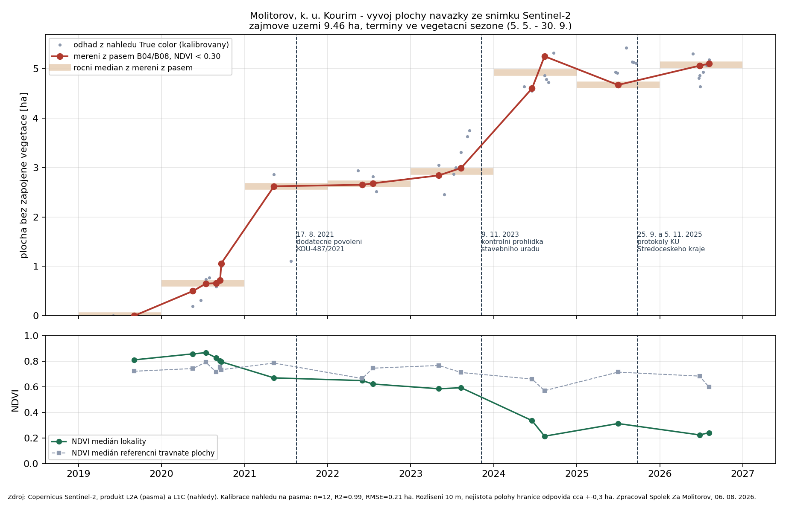
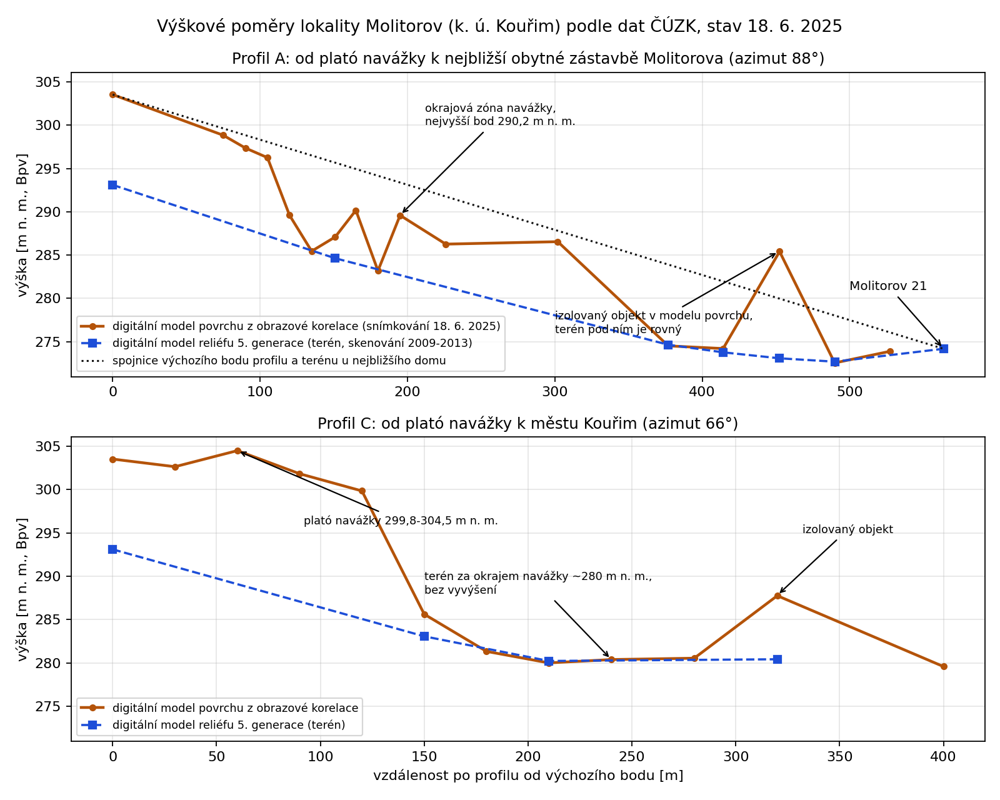

# Změřili jsme navážku: pět hektarů, čtyři sta tisíc kubíků

Kolik toho v Molitorově vlastně leží? Zjistit se to dá bez vstupu na pozemek. Jen z veřejných dat, která si může stáhnout kdokoli. Družice Sentinel-2 ukazují, jak rostla plocha: z nuly v roce 2019 na dnešních zhruba pět hektarů. Výškové mapy státního zeměměřického úřadu ukazují jak vysoko: povrch navážky je 23 až 29 metrů nad okolním terénem. A když se obojí spojí, vyjde objem kolem 419 tisíc kubíků a orientačně 700 až 800 tisíc tun. Projektová dokumentace, o kterou se povolení opírá, přitom řeší území o rozloze 3,26 hektaru.

<!-- more -->

## Jak plocha rostla

Časosběr z družicových snímků, leden 2020 až srpen 2026. Vpravo nahoře je datum snímku. Světlá skvrna uprostřed je navážka. Zbytek je golfové hřiště, pole a remízky.

Níže je podrobný graf plochy s vyznačenými termíny kontrolních prohlídek.

{ align=center }

## Krok první: plocha

Evropské družice Sentinel-2 snímkují každé místo v Česku přibližně jednou za pět dnů a snímky jsou volně ke stažení. Létají od roku 2015. Vzali jsme vzali 37 termínů od září 2019 do srpna 2026.

Družice zaznamenává, kolik světla se od povrchu odráží v jednotlivých barvách, snímky zaznamenávají i odraz infračerveného záření, které oko nevidí. Zelená rostlina infračervené světlo odráží velmi silně, holá zemina nebo štěrk mnohem méně. Z poměru těchto dvou hodnot se počítá index zeleně, kterému se říká NDVI. Louka má v létě kolem 0,8, čerstvě navezená hlína kolem 0,2.

Vymezili jsme si nad lokalitou pevnou plochu (9,46 hektaru), která je pro všechny termíny stejná. V ní jsme počítali, kolik hektarů má index nižší než 0,3, tedy je bez souvislého porostu.

{ align=center }

K 3. září 2019 nemá měřená plocha ani hektar bez vegetace. K 25. červnu 2026 jich je 5,06.

Dodatečné povolení terénních úprav z roku 2021 žádnou plochu ani kubaturu neuvádí. Podmínkou č. 1 ale ukládá, že úpravy budou provedeny podle projektové dokumentace ověřené ve stavebním řízení. Rozlohu území, které ta dokumentace řeší, zmiňuje protokol krajského úřadu z roku 2025 (č. j. 150678/2025/KUSK): **32 603 m², tedy 3,26 hektaru**. Proti tomu je dnešních 5,06 hektaru o 55 procent víc. 32 603 m² je plocha území, které dokumentace zpracovává, ne povolená velikost úprav. Vlastní úpravy mohou zabírat méně.

Naše číslo je plocha bez zapojeného vegetačního krytu odečtená z družicových dat. Skutečný rozsah by doložilo jedině geodetické zaměření. Nezávisle na plošném srovnání ale platí, že navážka leží i na pozemcích, které v povolení nejsou vůbec.

### Terén se začal měnit dřív, než přišlo povolení.

Stavební úřad vydal dodatečné povolení 17. srpna 2021. Družicové snímky ukazují půl hektaru bez vegetace už 18. května 2020 a 10. května 2021, tři měsíce před vydáním povolení, zhruba 2,6 hektaru. U tohoto jednoho termínu je výsledek citlivý na to, kde nastavíme hranici mezi porostlým a obnaženým povrchem: posun hranice s ním hýbe o 1,25 hektaru, poctivé rozpětí je tedy 1,7 až 3,0 hektaru. U termínů od roku 2022 je ta citlivost nejvýš 0,78 hektaru.

Na tom, že se terén měnil před povolením, není samo o sobě nic překvapivého. Dodatečné povolení se ze své podstaty vydává na něco, co už se děje, a úřad to věděl.

### Od roku 2024 to přestalo zarůstat

Do roku 2023 se obnažená zemina přes léto sama zazelenala. V roce 2021 byla plocha bez vegetace v květnu 2,62 hektaru a na konci října jen 0,53. To je chování hlíny, na které vyrostou kopřivy.

Původně byl v daném prostoru starý sad, je klidně možné, že na začátku to vše shrnuli buldozerem aby sad odstranili. Dělali to tu v okolí asi všichni, kdo likvidovali sad. Proto je na začátku skok v obnaženém povrchu, který následně znovu zarostl.

Mezi srpnem 2023 a březnem 2024 se to zlomilo. Od jara 2024 zůstává index na všech dostupných letních snímcích na úrovni obnaženého povrchu, zatímco okolní travnaté plochy vypadají pořád stejně. Pro podzimy posledních let termíny s měřitelnými pásmy chybí, takže o podzimním zarůstání data nic neříkají.

{ align=center }

Do stejného období, kdy se to zlomilo, spadá i kontrolní prohlídka stavebního úřadu z 9. listopadu 2023. Ta je v protokolu uzavřena slovy "bez připomínek". Mezi posledním snímkem před ní (11. srpna 2023, 2,99 ha) a prvním po ní (28. března 2024, 4,65 ha) plocha vzrostla o 1,66 hektaru.

## Krok druhý: výška

Družice vidí plochu, ale výšku z nich nevyčtete. Na tu má stát vlastní data, a taky volně dostupná.

ČUZK udržuje dva výškové modely celé republiky. **Model terénu** vznikl leteckým laserovým skenováním v letech 2009 až 2013 a zachycuje holý terén, jaký byl tehdy, bez staveb a vegetace. **Model povrchu** vzniká z leteckých měřických snímků a zachycuje všechno, co na terénu stojí. Pro Molitorov jsou dostupné poslední snímky z 18. června 2025.

Rozdíl obou modelů v jednom místě říká, o kolik je dnešní povrch výš než terén před patnácti lety. Vedli jsme přes lokalitu dva výškové profily: jeden směrem k nejbližším domům v Molitorově, druhý směrem na Kouřim.

{ align=center }

### Co z výškových profilů plyne

Navážka tvoří plató ve výšce 299,8 až 304,5 metru nad mořem. Terén u nejbližšího obytného domu je přitom na 274 metrech a terén směrem ke Kouřimi na 280 metrech. Povrch navážky je tedy 23 až 29 metrů nad okolním terénem. To odpovídá pohledu z místa: těleso dnes dosahuje výšky okolního lesního horizontu. Směrem ke Kouřimi končí navážka strmým svahem. Mezi 120. a 150. metrem profilu klesá povrch o 14 metrů.

Všechna výšková čísla platí ke dni snímkování, tedy k 18. červnu 2025. Co bylo navezeno později, v datech není.

## Krok třetí: objem a hmotnost

Když víme, kde navážka leží a o kolik je povrch výš než původní terén, stačí obojí spojit. Nad obdélníkem o ploše 4,65 hektaru uvnitř tělesa navážky jsme spočítali průměrnou výšku v obou modelech. Rozdíl je **9,0 metru**. Někde míň, někde víc, průměrně devět metrů nového materiálu na výšku.

Devět metrů krát 4,65 hektaru dává objem **přibližně 419 000 m³**. A protože zemina, kamenivo a stavební suť hutněné v tělese mívají objemovou hmotnost 1,6 až 2,0 tuny na kubík, odpovídá to **řádově 700 000 až 800 000 tun**.

Pro představu: kdyby to všechno vozily auta s užitečnou hmotností 20 až 33 tun, znamenalo by to **20 až 42 tisíc jízd s materiálem**. A stejný počet jízd prázdných náklaďáků zpátky.

## Limity

- Srovnávacím základem je terén z let 2009 až 2013, takže rozdíl zahrnuje všechno, co v lokalitě od té doby přibylo, a nelze ho ztotožnit s množstvím odpadů.
- Přepočet na tuny stojí na předpokladu objemové hmotnosti, kterou jsme neměřili, proto uvádíme rozpětí.
- Obdélník 4,65 hektaru nepokrývá celé těleso, takže objem je spíš dolní hranicí.
- Přesné množství zná evidence provozovatele, vážní listy a hlášení, která firmy podávají státu. Náš výpočet ji nemá nahrazovat, má ukázat řád.

I s těmi výhradami čísla do sebe zapadají. Firmy samy [ohlásily státu jako odpad 425 389 tun jen za roky 2023 a 2024](./2026-08-14-limit-10000-tun.md). Z objemu 419 tisíc kubíků vychází i [orientační propočet nákladů na odstranění, o kterém jsme psali včera](./2026-09-01-upozorneni-mesto-naklady.md): 190 až 260 milionů korun bez DPH.

## Pro šťouraly

### Plocha

#### Zdrojová data k ploše

Družice Sentinel-2 programu Copernicus, který provozuje Evropská unie. Data jsou volně dostupná v aplikaci [Copernicus Browser](https://browser.dataspace.copernicus.eu). Použili jsme pásma B04 (červené) a B08 (blízké infračervené) z produktu L2A, tedy po atmosférické korekci, ve formátu GeoTIFF, 37 termínů od 3. 9. 2019 do 5. 8. 2026. Doplňkově 38 barevných náhledů, které zahušťují mezery mezi termíny.

#### Postup u plochy

Z pásem se pro každý pixel spočítá NDVI = (B08 − B04) / (B08 + B04). Uvnitř pevného polygonu o rozloze 9,46 ha se sečtou pixely s hodnotou pod 0,3. Polygon není nakreslený od oka: je odvozený z dat jako souvislá plocha, která byla v letech 2023 až 2026 opakovaně bez vegetace, rozšířená o technický odstup zhruba 30 metrů. Končí před lesním pásem, před polními bloky a před silnicí, aby do měření nespadla sezonní orba okolních pozemků.

#### Co jsme udělali proti omylům

Vyhodnocujeme jen termíny od 5. května do 30. září, protože v zimě klesá index i na plochách, které zůstávají zatravněné. Z doplňkové řady barevných náhledů jsme vyřadili čtyři termíny se sněhem nebo oblačností. Jako kontrolu sledujeme dvě plochy mimo lokalitu, lesní pás a travnaté plochy hřiště. Ty se po celou dobu drží mezi 0,52 a 0,86, takže snímky jsou mezi sebou srovnatelné. Posunutí hranice polygonu o jeden pixel na obě strany mění výsledek nejvýš o 0,14 hektaru.

#### Kde měření plochy naráží na strop

Polygon jsme odvodili ze stavu v letech 2023 až 2026, takže měřená plocha nemůže přesáhnout 9,46 hektaru. Kdyby se navážka rozšířila mimo tuto obálku, měření by to nezachytilo. Toto zkreslení jde ve prospěch provozovatele: 5,06 hektaru je spíš dolní odhad než horní.

#### Kontrola proti leteckým snímkům.

U tří leteckých měřických snímků Českého úřadu zeměměřického a katastrálního existuje družicový snímek pořízený o jeden až dva dny později. Sedí: 3. června 2019 pod mezí zjistitelnosti, 11. srpna 2023 2,99 hektaru, 20. června 2025 4,93 hektaru.

## Výška

### Zdrojová data k výšce

Digitální model reliéfu 5. generace (DMR 5G, terén, laserové skenování 2009 až 2013, deklarovaná chyba výšky 0,18 m v odkrytém terénu) a digitální model povrchu z obrazové korelace (DMP OK, povrch, snímkování 18. 6. 2025). Oba poskytuje ČÚZK zdarma pod licencí CC-BY. Výšky jsme odečítali z veřejných služeb ČÚZK po bodech a statistikou nad vymezeným obdélníkem, souřadnice všech bodů jsou v připojeném podkladu, takže si každou hodnotu může kdokoli ověřit dotazem na tytéž služby.

### Data si můžete přepočítat sami

Měření plochy po jednotlivých termínech je v tabulce níže, metodu a čísla k výšce a objemu popisuje připojený podklad.

## Co z dat neplyne

Družicový index rozlišuje jenom to, jestli je povrch porostlý, nebo ne. Neříká nic o tom, co se do Molitorova vozí, jestli je to zemina, beton nebo něco jiného. To víme hlavně z [protokolů krajského úřadu](./2026-07-27-protokoly-krajskeho-uradu.md).

Výškové modely zase měří povrch, ne materiál pod ním. Z rozdílu modelů neplyne, co v tělese je, ani jaký režim to má. A rozlišení družice je deset metrů na pixel, takže všechny plochy jsou odhad, ne geodetické zaměření. Uvádíme je zaokrouhleně a s tím, že hranice může být o kus jinde.

## Co s získanými informacemi děláme

Rozbor plochy jsme 11. srpna přiložili k podnětu Státnímu pozemkovému úřadu, protože část pozemků pod navážkou leží v obvodu zahájených pozemkových úprav. Výškopis a propočet objemu jsou od 25. srpna přílohou [upozornění, které jsme poslali městu](./2026-09-01-upozorneni-mesto-naklady.md).

Územní plán v této ploše připouští "využití zaměřené výhradně na rekreační sport spojený s pobytem v krajinném prostředí", jako nepřípustné uvádí "skládky a skládkování materiálu" a zpevněné plochy omezuje na jedno procento se zásadou "plochy odpališť přednostně zatravněné". Pět hektarů, které na letních snímcích od jara 2024 zůstávají bez vegetace, je s tím těžko slučitelné.

26.8. uplynula prodloužená lhůta, do kdy měly být terénní úpravy dokončené, a stavební úřad má podle povolení nařídit závěrečnou kontrolní prohlídku. Ta má porovnat, co bylo povoleno, s tím, co je na místě. Na zasedání zastupitelstva jsme se proto ptali jestli existuje geodetické zaměření skutečného rozsahu. Přímá odpověď na zasedání nezazněla. V jiné části rozpravy pak starosta k proběhlým kontrolním prohlídkám uvedl, že se při nich nic závažného nenašlo a žádný postih z nich nevyšel.

## Dokumenty

- [Plocha bez zapojeného vegetačního krytu podle dat Sentinel-2, veřejný podklad](../../assets/info/files/sentinel/plocha-molitorov-podklad.pdf) (pdf)
- [Výškové poměry a objem navážky podle dat ČÚZK, veřejný podklad](../../assets/info/files/sentinel/vyskopis-molitorov-web-podklad.pdf) (pdf)
- [Měření plochy po jednotlivých termínech](../../assets/info/files/sentinel/sentinel-mereni-po-terminech.csv) (csv)
- Zdrojová data: [Copernicus Browser](https://browser.dataspace.copernicus.eu), výškové modely DMR 5G a DMP OK: [geoportál ČÚZK](https://geoportal.cuzk.cz).
