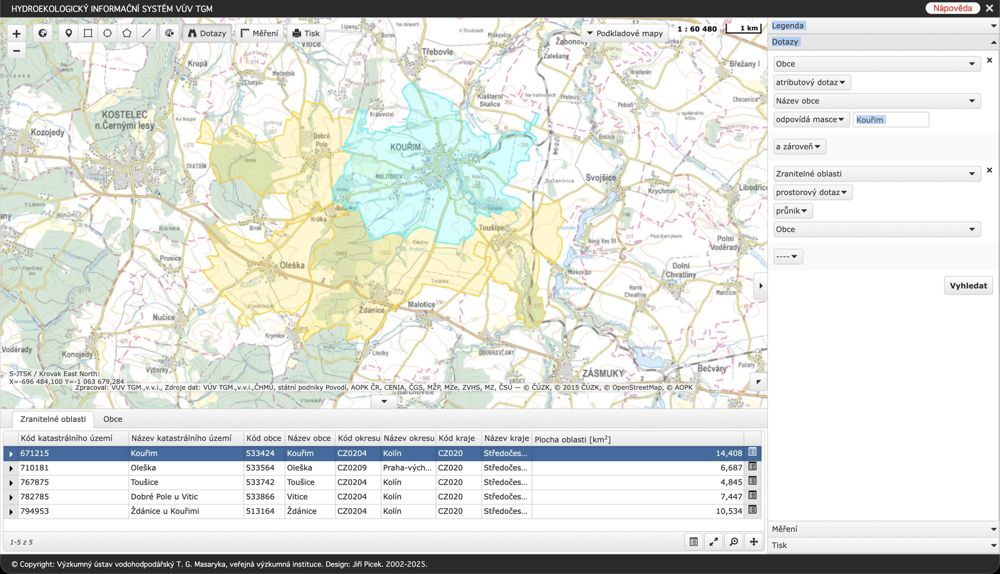
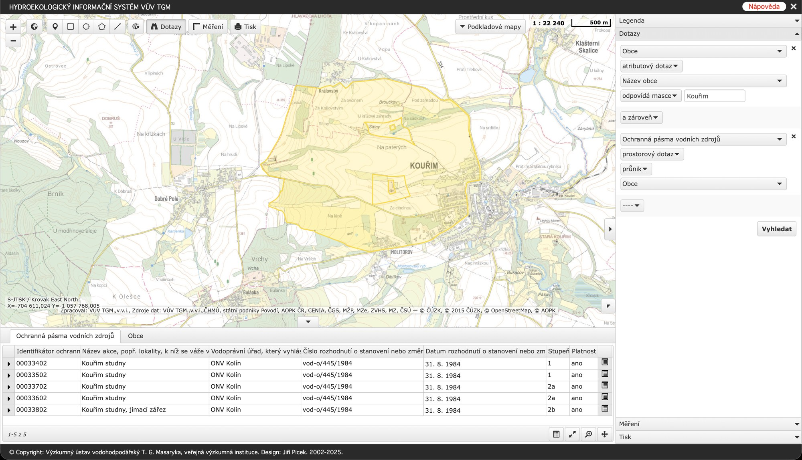

# Co víme o vodě pod Molitorovem

Na vodu se nás lidé ptají ze všeho nejčastěji. Sepsali jsme proto, co je k ní doloženo úředními dokumenty: proč je území citlivé, kolik stálo vyčištění staré ekologické zátěže o kus níž, co k navážce řekl vodoprávní úřad a která otázka zatím odpověď nemá.

<!-- more -->

## Území, kde se bere voda pro Kouřim

Vodoprávní úřad sídlí v Kolíně a k lokalitě se vyjádřil sdělením ze 4. srpna 2026 (č. j. MUKOLIN/OZPZ 125794/26-Gl, celé v Dokumentech). O citlivosti území v něm píše tohle:

> "Území je označeno jako zranitelné proto, že se nachází v hydrogeologické pozici křídových sedimentů, na které bývají vázány významnější vodní zdroje – v tomto případě i jímací území města Kouřim."

Jinými slovy: pod územím jsou vrstvy, ze kterých se čerpá pitná voda pro město, a jímací území leží hydrologicky níže než areál. Takhle území popisuje úřad, který má vodu v popisu práce.

Obojí se dá ověřit ve veřejném Hydroekologickém informačním systému VÚV TGM ([heis.vuv.cz](https://heis.vuv.cz)). Takhle vypadá vymezení zranitelných oblastí kolem Kouřimi:

A takhle ochranná pásma vodních zdrojů "Kouřim studny", stanovená rozhodnutím ONV Kolín vod-o/445/1984 už v roce 1984 a platná dodnes:

Oba snímky jsou z 28. července 2026.

## Sanace za 53 milionů

V Molitorově stával podnik Strojobal. Chlorované uhlovodíky z jeho provozu zamořily podzemní vodu, soukromou studnu v severní části Molitorova a jeden ze zdrojů pitné vody města - vrt v areálu kouřimské vodárny byl kvůli tomu odstaven.

Vyčištění trvalo šest let, od listopadu 2017 do listopadu 2023, a stálo 53 843 980 Kč. Z dotace Ministerstva životního prostředí a evropských fondů šlo 45 767 382,86 Kč, z havarijního fondu Středočeského kraje 8 076 597 Kč. Součástí byla obnova odstaveného vrtu.

Do lokality Molitorova, jen o pár stovek metrů vedle "Strojobalu", bylo podle ročních hlášení [jen za roky 2023 a 2024 přijato 425 389 tun odpadů](https://skladka-molitorov.cz/info/2026/08/14/2026-08-14-limit-10000-tun/).

## Co k navážce řekl vodoprávní úřad

Na naše podání odpověděl úřad za čtyři dny. Věcné jádro odpovědi zní:

> "Navážené materiály neobsahovaly látky nebezpečné vodám a neohrožovaly kvalitu a vydatnost vodních zdrojů, včetně vodního zdroje Golf Clubu Molitorov."

Úřad se přitom odkazuje na místní šetření stavebního úřadu v Kouřimi, ke kterým byl přizván. A slibuje: "Věcí se dále budeme zabývat i my, a jakmile budeme mít relevantní výsledky, podáme Vám neprodleně příslušné informace."

## Na čem to ujištění stojí

Za prvé, místní šetření, na která úřad odkazuje, proběhla v prosinci 2022 a v listopadu 2023. Oněch 425 389 tun bylo podle hlášení přijato v letech 2023 a 2024, tedy z podstatné části až po těchto šetřeních. Šetření nemohlo posoudit materiál, který v době jeho konání na místě ještě neležel.

Za druhé, při prohlídce v prosinci 2022 bylo uvedeno, že rozbory navážených materiálů budou posouzeny. Že se tak stalo, není doloženo v žádném dokumentu, který máme k dispozici.

Za třetí, krajský úřad v [protokolu o kontrole](https://skladka-molitorov.cz/assets/info/files/106_ku/Protokol_o_kontrole_-_STOCHL_GROUP_s.r.o..pdf) sám uvádí, že při zasypávání odpady v množství nad 1 000 tun je nutné hodnocení rizika podle § 6 odst. 6 vyhlášky č. 273/2021 Sb., které řeší mimo jiné rizika z hlediska geologie a hydrogeologie. Přijato bylo více než čtyřsetnásobek tohoto prahu a hodnocení rizika není doloženo nikde.

## Co měří postsanační monitoring

Po sanaci Strojobalu běží v území dodnes postsanační monitoring podzemních vod a úřad k němu uvádí, že "není dlouhodobě zjištěno jiné znečištění". V území tedy existuje síť vrtů, ze kterých se průběžně měří.

Uklidnění ale platí jen v rozsahu toho, co se měří. Monitoring po sanaci chlorovaných uhlovodíků standardně sleduje látky, kvůli kterým se sanovalo. Případný výluh ze stavebních a demoličních odpadů se pozná na jiných ukazatelích: sírany, chloridy, celková mineralizace, pH, kovy. Jestli je program molitorovského monitoringu měří, veřejně známo není.

Požádali jsme proto vodoprávní úřad o program monitoringu (které vrty, jaké ukazatele, jak často), o výsledky měření za roky 2020 až 2026, o seznam vrtů se souřadnicemi a o směr proudění podzemní vody v lokalitě. Obě možné odpovědi věc posunou. Měří-li se i tyto ukazatele, existuje šest let dat přímo z období, kdy navážka rostla - a vyjde-li z nich, že se nic neděje, napíšeme to tady. Měří-li se jen chlorované uhlovodíky, pak věta o nezjištěném znečištění vypovídá o staré zátěži, ne o navážce. Směr proudění podzemní vody přitom rozhoduje, jestli navážka leží nad zdrojem, po proudu, nebo stranou. Bez něj je jedno jak je navezený odpad daleko.

## Co dál

Úřad ve sdělení také uvedl, že Česká inspekce životního prostředí ho k součinnosti do 4. srpna nevyzvala. Inspekce se dosud věnovala odpadové stránce věci - [pokutu za provoz zařízení v rozporu s povolením](https://skladka-molitorov.cz/info/2026/08/25/2026-08-25-pokuta-cizp-pravomocna/) pravomocně uložila v dubnu. Vodoprávní úřad je zatím jediný orgán, který se k vodě vyjádřil věcně, a jeho slib informovat nás o výsledcích bereme vážně. Jakmile přijde odpověď na naši žádost, napíšeme, co v ní je.

## Dokumenty

- [Sdělení vodoprávního úřadu MěÚ Kolín ze 4. 8. 2026, č. j. MUKOLIN/OZPZ 125794/26-Gl (PDF)](../../assets/info/files/voda/MUKOLIN_OZPZ_125794_26_sdeleni_20260804.pdf)
- [Firmy nahlásily státu 425 389 tun za dva roky](https://skladka-molitorov.cz/info/2026/08/14/2026-08-14-limit-10000-tun/) - kontext k množství
- [Pokuta 800 000 Kč je pravomocná](https://skladka-molitorov.cz/info/2026/08/25/2026-08-25-pokuta-cizp-pravomocna/) - odpadová linka
- [Změřili jsme navážku: pět hektarů, čtyři sta tisíc kubíků](https://skladka-molitorov.cz/info/2026/09/02/2026-09-02-mereni-navazky/) - rozsah navážky z veřejných dat
