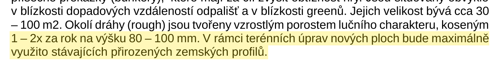
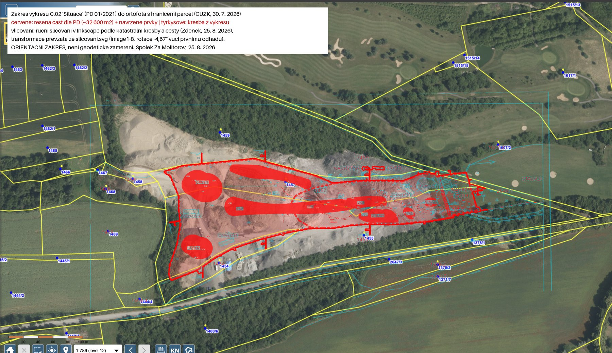

# EIA na golfovou akademii - k čemu vlastně je?

Když se v Molitorově řekne "EIA", myslí se tím posouzení vlivů na životní prostředí z roku 2021. Úřady se na ně odvolávají dodnes, Městský úřad Kolín třeba v prosinci 2022 občanovi odpověděl, že "v Molitorově není povolena skládka odpadů, ale je zde povoleno Rozšíření stávajícího golfového areálu", což je název záměru právě z EIA. Přečetli jsme celý spis a dáváme ho k dispozici. Je to popis tříjamkového cvičného hřiště pro děti, které mělo být hotové na podzim 2023. Po pěti letech se hodí porovnat, co bylo slíbeno a co z toho stojí.

<!-- more -->

## Co bylo slíbeno

Oznámení záměru "Rozšíření stávajícího golfového areálu v k.ú. Kouřim" má 33 stran, je datované 27. dubna 2021 a krajskému úřadu došlo 17. května. Zpracoval ho Tomáš Skočdopole, který v řízení zastupoval oznamovatele, vlastníka pozemků Reality Molitorov, s.r.o. Oznámení je veřejné v informačním systému EIA pod kódem STC2385 a od dneška i zde.

Stavba je v něm popsaná takto: Stávající osmnáctijamkové hřiště se rozšíří západním směrem o pozemky o rozloze 32 603 m². Vznikne nové cvičné odpaliště a tři cvičné jamky "pro celkem 12 hráčů", protože ve městě stoupá "poptávka po golfové hře (zejména u dětí školního věku)". Terén:

{ align=center }

Dál: "Bilance zeminy bude záporná", doveze se "neznečištěná zemina" v "maximálním množství 10 000 tun", každá dodávka s laboratorním rozborem. Zařízení staveniště budou tvořit "tři stavební buňky a plocha pro mechanizaci o velikosti cca 35 m²". Práce "pouze v pracovní dny, v denní dobu (7 - 19 hod.)". Zahájení květen 2021, dokončení stavby říjen 2023, od května 2024 se hraje golf. Na volných plochách bude vysazeno dvě stě stromů a dvě stě keřů, o které se bude pět let odborně pečovat, s oznámením výsadby městskému úřadu do čtrnácti dnů. Hluk i prach budou "zanedbatelné" vzhledem ke "krátké lhůtě výstavby a minimálnímu množství použitých strojů". A výslovně: "Nepřibude žádný nový stacionární ani mobilní zdroj znečištění ovzduší." O drcení, třídění nebo přejímce materiálu od cizích firem není v celém dokumentu ani slovo.

K oznámení jsou přiložena dvě stanoviska k projektové dokumentaci Ing. Karla Fouska, podle které se hřiště mělo stavět:

- stanovisko úřadu územního plánování v Kolíně z února 2021
- a stanovisko krajského úřadu k vlivu na chráněná území z dubna 2021.

Z nich se dozvíme, jak měla vypadat golfová část projektu:

- mezi starým a novým hřištěm val s odpalištěm a pochozím chodníkem,
- kolem odpališť zámková dlažba,
- příjezdová cesta po stávající polní cestě zpevněná štěrkem "jako příprava pro budoucí pojezdovou vrstvu z asfaltobetonu"
- a nad valem "parkovací plocha pro vozidla návštěvníků".

Třetí listina, souhlas krajského úřadu s odnětím 1,9 hektaru zemědělské půdy z 6. dubna 2021, přidává, jak se mělo zacházet s ornicí: sejmout ji z celé plochy, 3 808 m³ po dokončení rozprostřít zpět na hřiště ve vrstvě do dvaceti centimetrů, zbytek předat na sousední pozemky, a o všem vést pracovní deník. K souhlasu je přiložen výkres C.02 Situace z ledna 2021. Je to jediná část projektové dokumentace, kterou nám dosud některý úřad poskytl.

Výkres jsme položili na aktuální letecký snímek s hranicemi parcel, abychom viděli, kam projekt míří a kam navážka došla:

{ align=center }

*Červeně čárkovaně řešená část podle projektu (32 603 m²) s navrženými greeny, tyrkysově kresba z výkresu, podklad ortofoto a katastrální mapa ČÚZK ze 30. 7. 2026. Usazení výkresu je ruční, podle katastrální kresby a cesty na hranici pozemků, je to orientační.*

## Co na to úřady

Proč se vůbec dělala EIA, je vidět v dopise krajského úřadu ze 7. dubna 2021 (č. j. 035959/2021/KUSK). Zástupce investora se v březnu kraje zeptal, jestli bude pro terénní úpravy potřeba povolení k nakládání s odpady. Kraj odpověděl, že do 10 000 tun neznečištěné zeminy povolení k zasypávání nepotřebuje, ale že záměr je "významnou změnou stávajícího záměru" a musí projít zjišťovacím řízením podle zákona o posuzování vlivů. Odpověď se podle vlastních slov vztahuje jen k tomu, "že v rámci projektu nemá být použito více než 10 000 tun neznečištěné odpadní zeminy k zasypávání". Tentýž strop, deset tisíc tun odpadu, zapsal 24. března 2021 odbor životního prostředí v Kolíně do závazného stanoviska, na které se pak odvolává podmínka č. 9 dodatečného povolení. [O tom, jak to dopadlo s deseti tisíci tunami, jsme psali v srpnu.](./2026-08-14-limit-10000-tun.md)

Zjišťovací řízení pak proběhlo bez zádrhelu. Krajský úřad oznámení rozeslal a do konce června dostal pět vyjádření, od Městského úřadu Kolín, hygieny, inspekce životního prostředí, vlastního odboru a Středočeského kraje, všechna bez připomínek. Krajská hygienická stanice souhlas odůvodnila dvěma větami z oznámení: práce jen v pracovních dnech od 7 do 19 hodin a hřiště leží mimo obytnou zástavbu. Inspekce upozornila jen na to, "že terénní úpravy musí být také schváleny příslušným stavebním úřadem".

Dne 2. července 2021 krajský úřad rozhodl, že takto popsaný záměr "nemůže mít významný vliv na životní prostředí a nebude posuzován podle zákona". V rozhodnutí je záměr shrnut takto:

- velikost rozšíření 32 603 m²,
- nové odpaliště,
- tři tréninkové jamky,
- "množství navezené zeminy - 10 000 t",
- parcely 1455, 1457, 2646/1 a 1607/2.

Rozhodnutí neobsahuje žádné podmínky. Šest a půl týdne poté, 17. srpna 2021, vydal stavební úřad Kouřim [dodatečné povolení terénních úprav](./2026-08-13-mesto-zverejnilo-dokumenty.md), podle kterého se má stavět dodnes.

## Na co EIA je

Slovo EIA se používá, jako by šlo o povolení. Není to povolení. Zjišťovací řízení je filtr. Odpovídá na jedinou otázku: je záměr tak významný, že má projít plným posouzením s dokumentací, posudkem a veřejným projednáním? Když úřad odpoví "ne", jako v roce 2021 v Molitorově, vydá o tom rozhodnutí bez jakýchkoli podmínek. Nic tím nepovoluje a nic nezakazuje. Říká jen: tohle, jak jste to popsali, není třeba dál zkoumat.

Věty z oznámení o pracovních dnech, rozborech nebo dvou stech stromech nejsou ničím, co by úřad mohl vymáhat s odkazem na EIA. Závazné se z nich stalo jen to, co si jiné úřady přepsaly do vlastních rozhodnutí:

- strop deseti tisíc tun přes stanovisko Kolína a podmínku č. 9,
- zacházení s ornicí přes souhlas s odnětím půdy,
- podmínky správce plynovodu přes podmínku č. 8. A rozhodnutí platí pro záměr, jak byl popsán.

Zákon říká, že když se u takového záměru významně zvýší kapacita nebo změní technologie, musí změna znovu projít zjišťovacím řízením. Krajský úřad to napsal do protokolu o kontrole z roku 2025 vlastními slovy: zjišťovací řízení "drcení a třídění takového množství odpadů nikterak neřešilo", a od firem, které dnes žádají o povolení provozu, [chce závěry nového zjišťovacího řízení](./2026-08-31-kraj-nema-jak-zastavit.md). Podle jeho sdělení z 5. srpna 2026 od září 2025 žádné nové oznámení nedostal.

Odpověď na otázku z titulku je tedy prostá. EIA z roku 2021 nikoho k ničemu nezavazuje a nic nepovoluje. Je to ale jediný dokument, ve kterém investor státu vlastními slovy popsal, co staví. A to se dá po pěti letech porovnat s tím, co stojí.

## Co z toho po pěti letech stojí

Z oznámení, jeho příloh a souhlasu s odnětím půdy jsme sepsali všechno, co mělo do října 2023 vzniknout, a porovnali to s tím, co je vidět z veřejně přístupných míst a z veřejných dat. U položek, kde nemáme úřední doklad, píšeme "podle našeho pozorování".

| Slíbeno v roce 2021                                                                  | Stav v září 2026                                                                                                                                                                                                                                                                                                                                                                                                                                                                                       |
| ------------------------------------------------------------------------------------ | ------------------------------------------------------------------------------------------------------------------------------------------------------------------------------------------------------------------------------------------------------------------------------------------------------------------------------------------------------------------------------------------------------------------------------------------------------------------------------------------------------ |
| Tři cvičné jamky, greeny, bunkery, zatravnění                                        | Podle našeho pozorování žádná zatravněná jamka ani odpaliště, [letecký snímek z 26. srpna 2026](./2026-08-31-kraj-nema-jak-zastavit.md) ukazuje holou plochu bez jediného greenu. Povrch tělesa je od jara 2024 na všech letních družicových snímcích bez vegetace ([měření z 2. 9.](./2026-09-02-mereni-navazky.md))                                                                                                                                                                                  |
| "Maximálně využito stávajících přirozených zemských profilů"                         | Povrch navážky je podle dat zeměměřického úřadu 23 až 29 metrů nad okolním terénem                                                                                                                                                                                                                                                                                                                                                                                                                     |
| Val mezi hřišti s odpalištěm a pochozím chodníkem, zámková dlažba                    | Val stojí, je to samo těleso navážky mezi stávajícím odpalištěm a novou plochou. Odpaliště na něm, pochozí chodník ani zámková dlažba podle našeho pozorování nejsou                                                                                                                                                                                                                                                                                                                                   |
| Příjezdová cesta po stávající polní cestě, zpevněná štěrkem jako příprava pro asfalt | Cesta není asfaltovaná, je rozježděná od nákladních vozů a zarůstá. Nepoužívá se, doprava jezdí novým sjezdem přímo ze silnice, který na leteckém snímku z roku 2021 ještě není a na snímku z roku 2023 už je                                                                                                                                                                                                                                                                                          |
| Parkoviště pro návštěvníky nad valem                                                 | Podle našeho pozorování neexistuje. Kde přesně mělo být, z výkresu C.02 neumíme určit                                                                                                                                                                                                                                                                                                                                                                                                                  |
| Ornice zpět na hřiště ve vrstvě do 20 cm, pracovní deník                             | Krajský úřad jako orgán ochrany půdy od 1. 1. 2022 neprovedl žádnou kontrolu (sdělení č. j. 113990/2026/KUSK, [časová osa k 13. 8.](../../casova-osa.md)), plnění podmínek nikdo neověřil                                                                                                                                                                                                                                                                                                              |
| 200 stromů a 200 keřů do konce roku 2022, oznámení výsadby městu                     | Nic. [Letecký snímek z 26. srpna 2026](./2026-08-31-kraj-nema-jak-zastavit.md) i [video z téhož dne](./2026-08-29-video-staveniste-golfu.md)                                                                                                                                                                                                                                                                                                                                                           |
| Tři stavební buňky a 35 m² pro stroje                                                | Podle našeho pozorování je jediným zázemím v areálu buňka s váhou u sjezdu, tedy vybavení pro přejímku materiálu, ne pro stavbu hřiště. Stojí podle ortofotomapy na parcele 1454, která v oznámení ani v povolení není.                                                                                                                                                                                                                                                                                |
| Hotovo v říjnu 2023, od května 2024 se hraje golf                                    | Provoz zařízení na odpady běží čtvrtým rokem, [takhle to vypadalo 26. srpna 2026](./2026-08-29-video-staveniste-golfu.md), v den, kdy uplynula prodloužená lhůta k dokončení                                                                                                                                                                                                                                                                                                                           |
| Nejvýše 10 000 tun dovezené zeminy                                                   | Firmy samy [ohlásily státu jako odpad 425 389 tun](./2026-08-14-limit-10000-tun.md) jen za roky 2023 a 2024                                                                                                                                                                                                                                                                                                                                                                                            |
| "Nepřibude žádný nový stacionární ani mobilní zdroj znečištění ovzduší"              | Kraj vydal firmám ze skupiny ŠTOCHL GROUP dvě povolení podle zákona o ochraně ovzduší pro mobilní drticí a třídicí linky (2023 pro invest, 2024 pro recyklace, projektovaná kapacita 550 000 a 1 022 000 tun ročně). Jsou to povolení k emisím prachu ze strojů, platí pro provoz kdekoli a ukládají jen ohlásit obci pět dní předem každé zahájení a ukončení provozu v dané lokalitě. Nejsou to povolení k nakládání s odpady, [o ta se u kraje teprve žádá](./2026-08-31-kraj-nema-jak-zastavit.md) |

Z golfové části projektu tedy podle všeho, nestojí nic kromě valu. A val je sama navážka. Z části navážení materiálu stojí všechno a víc.

## Dokumenty

- [Oznámení záměru "Rozšíření stávajícího golfového areálu v k.ú. Kouřim", duben 2021](../../assets/info/files/eia-golf-vystavba/EIA_STC2385_oznameni_zameru_20210427.pdf) (pdf, 33 stran, bez telefonního čísla zástupce)
- [Příloha H oznámení: stanovisko úřadu územního plánování z 8. 2. 2021 a stanovisko krajského úřadu z 29. 4. 2021](../../assets/info/files/eia-golf-vystavba/EIA_STC2385_priloha_H_stanoviska_UP_a_45i.pdf) (pdf, sken)
- [Rozhodnutí - závěr zjišťovacího řízení č. j. 061707/2021/KUSK ze 2. 7. 2021](../../assets/info/files/eia-golf-vystavba/EIA_STC2385_zaver_zjistovaciho_rizeni_061707_2021_KUSK_20210702.pdf) (pdf)
- [Vyjádření Krajské hygienické stanice č. j. KHSSC 26326/2021 z 8. 6. 2021](../../assets/info/files/eia-golf-vystavba/EIA_STC2385_vyjadreni_KHS_26326_2021_20210608.pdf) (pdf)
- [Sdělení krajského úřadu č. j. 035959/2021/KUSK ze 7. 4. 2021 k terénním úpravám](../../assets/info/files/eia-golf-vystavba/KUSK_035959_2021_sdeleni_k_terennim_upravam_20210407.pdf) (pdf, 3 strany)
- [Souhlas s odnětím zemědělské půdy sp. zn. SZ_032848/2021/KUSK ze 6. 4. 2021](../../assets/info/files/eia-golf-vystavba/KUSK_SZ_032848_2021_souhlas_odneti_ZPF_20210406.pdf) (pdf) a jeho příloha, [výkres C.02 Situace z ledna 2021](../../assets/info/files/eia-golf-vystavba/PD_vykres_C02_situace_012021.pdf) (pdf, A3)
- [Dodatečné povolení terénních úprav č. j. KOU-487/2021 ze 17. 8. 2021](../../assets/info/files/uredni_deska_20260813/45-2026-stavebni-urad.pdf) (pdf, sken zveřejněný městem Kouřim)
- [Závazné stanovisko MUKOLIN/OZPZ 26582/21-Ze ze 24. 3. 2021](../../assets/info/files/106_zp_kolin_20260806/ZS_MUKOLIN_26582_21_Ze_20210324.pdf) (pdf)
- Celý spis EIA včetně vyjádření ostatních úřadů je v [Informačním systému EIA pod kódem STC2385](https://portal.cenia.cz/eiasea/detail/EIA_STC2385)
