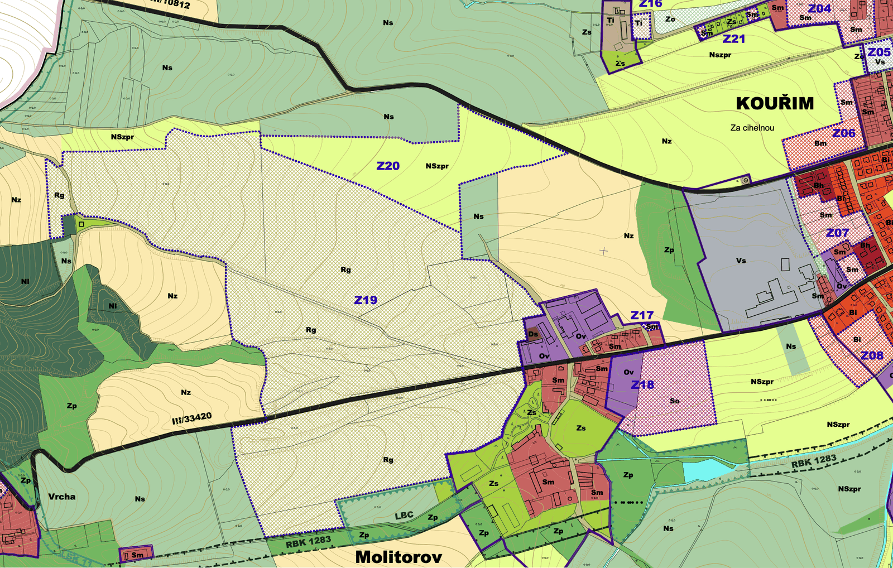

# V roce 2024 se řešilo rozšíření hřiště o hektar a půl

Máme v ruce závazné stanovisko Městského úřadu Kolín z června 2024. Stojí v něm, že plocha stavby golfového hřiště v Molitorově se má zvětšit z 32 603 m² na 47 113 m². Informace se k nám dostala vlastně náhodou, jako vedlejší efekt jiné žádosti.

<!-- more -->

## Jak jsme se k tomu dostali

V září jsme Městský úřad Kolín požádali o podklady k závaznému stanovisku orgánu územního plánování z února 2021, tedy k jednomu z dokumentů, které stály u zrodu dodatečného povolení terénních úprav. Spolu s tím jsme se zeptali, jestli úřad k těm pozemkům vydal i nějaké další stanovisko.

Odpovědí č. j. MUKOLIN/KU 150620/26-kus ze dne 14. září 2026 úřad sdělil, že ano, a listinu přiložil:

> "Městský úřad Kolín vydal na základě žádosti doručené dne 28.05.2024 prostřednictvím datové schránky, včetně přiložené plné moci a projektové dokumentace, závazné stanovisko č. j. MUKOLIN/OIÚP 72680/24-sindv1 ze dne 05.06.2024 ke změně stavby před dokončením."

## Co je v tom stanovisku

Asi nejdůležitější věta:

> "Změna stavby před jejím dokončením spočívá v terénních úpravách pro rozšíření záměru stavby golfového hřiště z původní výměry 32 603 m2 o dalších 14 510 m2 na celkovou plochu stavby 47 113 m2."

Je to nárůst téměř o polovinu proti původní výměře, se kterou počítalo dodatečné povolení z roku 2021.

Kolínský úřad záměr posoudil jako přípustný:

> "Předložený záměr je přípustný z hlediska souladu s politikou územního rozvoje, zásadami územního rozvoje a územním plánem Kouřimi i z hlediska uplatňování cílů a úkolů územního plánování. Nestanovujeme žádné podmínky pro jeho uskutečnění."

Podkladem byl podle odůvodnění územní plán Kouřimi po Změně č. 1, účinné od 5. ledna 2023, a plocha je v něm vedena jako zastavitelná plocha **Z19, tedy rekreace na plochách přírodního charakteru**. Stanovisko platilo dva roky ode dne vydání, tedy do 5. června 2026.

Takhle plocha Z19 vypadá v hlavním výkresu územního plánu. Je to šrafované území mezi Molitorovem a Kouřimí po obou stranách silnice III/33420, s kódem využití Rg:

Poslední odstavec listiny je poznámka:

> "Pozn. V místě výstavby se nachází bezpečnostní pásmo plynovodu DN 900 a DN 1000."

## Co se z listiny nedovíme

Parcelní čísla jsou v poskytnuté kopii začerněná, takže z ní nelze zjistit, kterých konkrétních pozemků se rozšíření mělo týkat. Vlastníkem je podle stanoviska společnost Reality Molitorov, s.r.o., u jedné z dotčených parcel úřad uvádí, že je pro záměr opatřena věcným břemenem.

Závazné stanovisko samo o sobě nic nepovoluje, ale je podklad pro řízení u stavebního úřadu, který vydává povolení vlastním rozhodnutím. Jestli takové rozhodnutí padlo a co v něm stálo, nevíme.

## Lhůta povolení z roku 2021

Dodatečné povolení terénních úprav z roku 2021 mělo lhůtu k dokončení do 26. srpna 2024. Žádost o závazné stanovisko ke změně stavby před dokončením dorazila na Městský úřad Kolín 28. května 2024, tedy necelé tři měsíce před uplynutím té lhůty.

Lhůta byla později prodloužena o dva roky, do 26. srpna 2026. Rozhodnutí o tom prodloužení jsme dosud neviděli.

Podle sdělení stavebního úřadu v Kouřimi č. j. KOU-2465/2026 ze dne 2. září 2026 podal stavebník 13. července 2026 žádost, kterou úřad označuje jako "žádost o prodloužení platnosti stavebního povolení", vedenou pod č. j. KOU-2081/2026. Nemáme informaci co přesně v žádosti je.

Do letošního září jsme o žádném rozšiřování záměru nevěděli. Celou dobu se mluvilo o dokončení hřiště podle povolení z roku 2021.

## Dokumenty

- [Závazné stanovisko MěÚ Kolín č. j. MUKOLIN/OIÚP 72680/24-sindv1 ze dne 5. 6. 2024 (PDF)](../../assets/info/files/rozsireni_2024/MUKOLIN_OIUP_72680_24_zavazne_stanovisko_20240605.pdf)
- [Odpověď MěÚ Kolín č. j. MUKOLIN/KU 150620/26-kus ze dne 14. 9. 2026 (PDF)](../../assets/info/files/rozsireni_2024/MUKOLIN_KU_150620_26_odpoved_20260914.pdf)

Souvislosti najdete v [časové ose](../../casova-osa.md) a v [Příběhu skládky](https://skladka-molitorov.cz/pribeh/).
